# 🔥C언어 Algorithm

### 🌈연결리스트 구현

>포인터의 경우, 변수에 **저장된 주소 값**과 변수 **자체의 주소 값**을 혼동하지 않도록 하기
>
>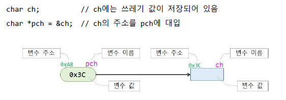
>
>#### 단계 1. 함수 사용 안하는 버전으로 작성하기
>
>>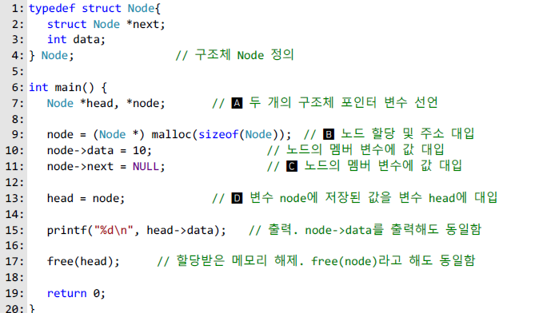
>>
>>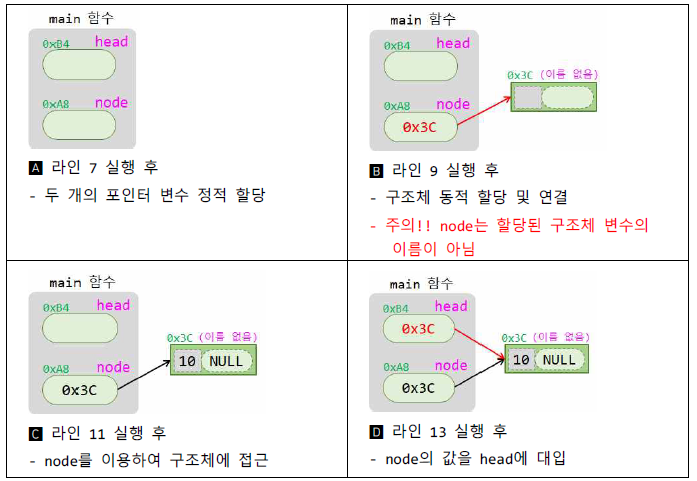
>
>#### 단계 2. 노드 할당하고 초기화 하는 부분을 함수로 작성하기
>
>>아래의 예시는 정상 작동하지 않는 코드
>>
>>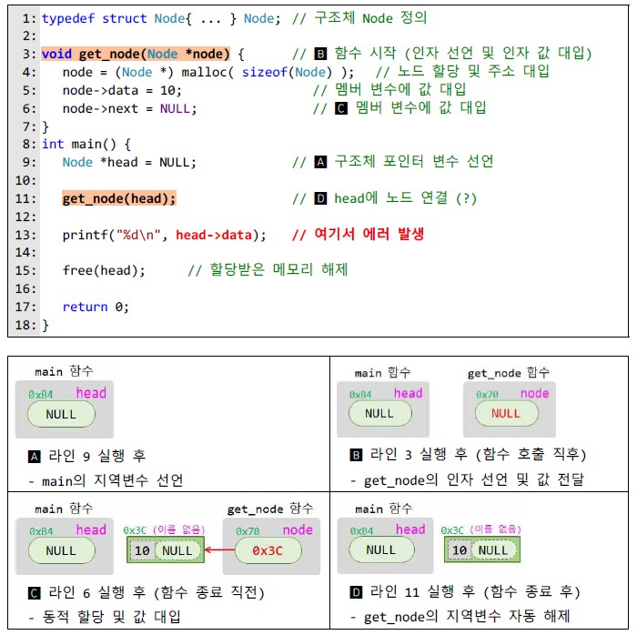
>>
>> get_node의 인자 node는 get_node의 지역변수 이므로, 이 값이 바뀌는 것은 메인의 변수 head에 
>>
>>아무런 영향을 주지 않는다. 따라서 main의 변수 head의 값은 함수 호출 후에도 여전히 널이고,
>>
>>라인 13에서 head가 가 르키는 구조체를 참조하려고 할 때, 실행 오류가 난다.
>>
>>
>>
>>따라서 main의 변수 head의 값을 동적 할당된 구조체의 주소로 변경해야 한다.
>
>#### 방법A: 함수의 리턴 값을 활용하는 방법
>
>>함수에서 구조체의 주소 값을 리턴하고, main에서는 리턴된 값을 head에 대입
>>
>>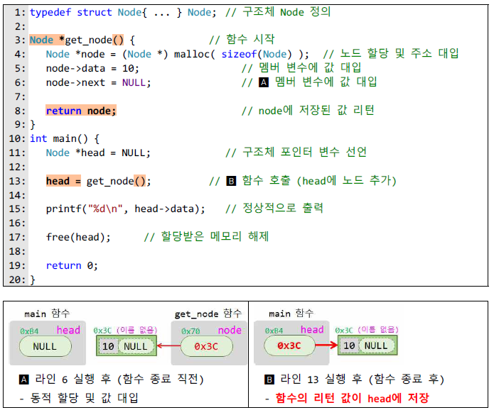
>>
>>main에서 get_node로 전달해야 할 정보가 없기 때문에, 인자는 필요 없다.
>>
>>방법이 제일 쉽지만 main에 리턴해야 할 값이 두 개 이상인 경우에는 사용 할 수 없다.
>
>#### 방법B: 이중 포인터를 활용하는 방법
>
>>변수 head의 주소를 인자로 전달하여 get_node  함수에서 직접 head의 값 변경
>>
>>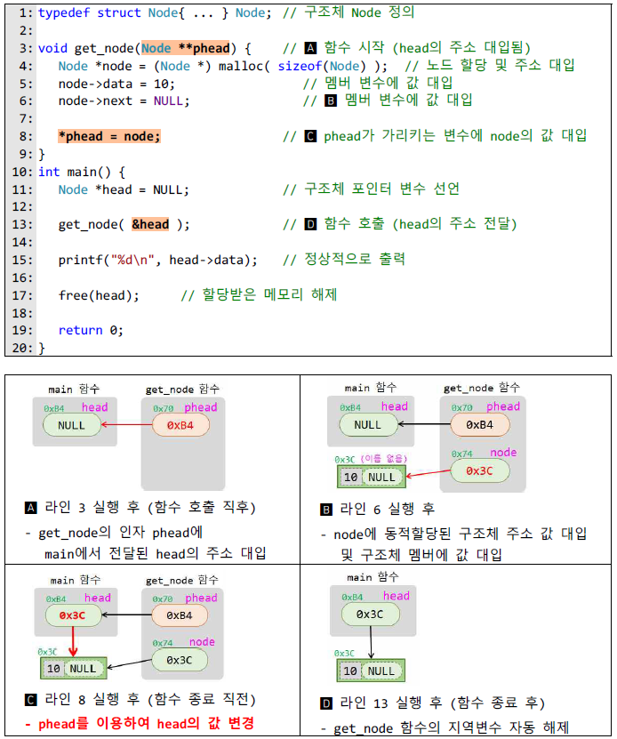
>>
>>head의 주소를 get_node함수에 인자로 전달하여, get_node함수에서 간접 참조를 통해
>>
>>변수 head에 저장된 값을 변경한다는 점이다.
>>
>>이 방법은 함수에 의해 변경되어야 할 값이 두개 이상인 경우에 사용 가능하지만, **이중 포인터**를 사용
>
>#### 방법C : head를 구조체로 감싸는 방법
>
>>head의 자체의 주소가 아니라 **head를 감싼 구조체의 주소를 전달**하여 head의 값 변경
>>
>>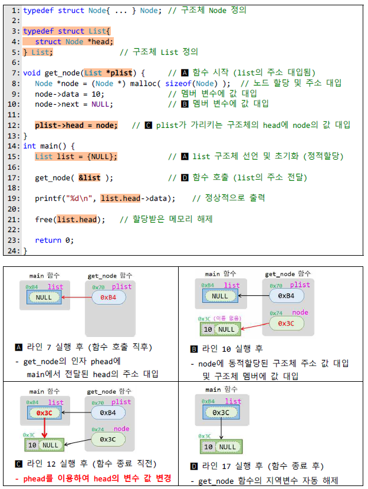
>>
>>이 방법은 방법 B와 본질적으로 동일하고 문법적 측면에서 이중 포인터를 피할 수 있다.
>>
>>또 한 List 라는 자료형을 따로 구현하여 의미적으로 명확해 진다.
>>
>
>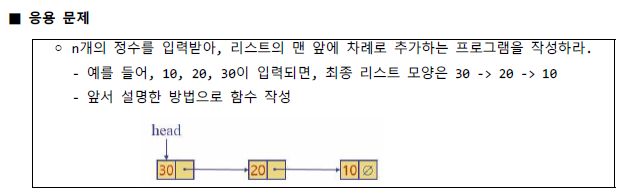
>
>연결리스트 구현 파일 안에 Method 방법들 코드 구현하였음.

### 🔄우선순위 큐(선택,버블  & 삽입 정렬)

>Priority Queue의 구현은 크게 두가지로 나뉜다
>
>\- List
>
>>unorderd list (무순리스트)
>>
>>ordered list (순서리스트)
>
>\- Binary Heap
>
>여기서 List의 구현은 또 두가지로 나뉜다
>
>\- Array (배열)
>
>\- Linked List (연결리스트)
>
>그리고 Binary Heap은 **Complete Binary Tree**(완전이진트리)를 기반으로 한다
>
>완전이진트리는 당연히 Tree의 한 종류이고, Tree의 구현도 두가지인데 리스트의 구현과 동일함
>
>
>
>이제 우선순위 큐 정렬 방법에 대해 알아보자
>
>버블정렬은 비슷하며 버블 정렬은 옆에 있는 값과 비교하여 더 작은 값을 
>
>반복적으로 앞으로 보내는 정렬 방식이며 가장 쉽지만 비효율적인 정렬이다.
>
>선택정렬은 매 반복마다 가장 큰 값을 찾아, 오른쪽부터 채우는 방식으로 정렬 혹은 왼쪽
>
>으로 채우는 정렬을 말한다.
>
>버블정렬과 선택정렬의 시간복잡도는 포문을 2번 돌기 떄문에 
>
>즉 보편적으로 내부순환도 O(n) 외부에서 O(N)이기 때문에  O(n^2) 이다.
>
>#### 버블 ,선택 제자리 정렬 코드
>
>>```c
>>#include<stdio.h>
>>int main() {
>>	int i, j, temp, a,*arr;
>>	scanf("%d",&a);
>>	arr = (int*)malloc(sizeof(int)*a);
>>	for (i = 0; i < a; i++) {
>>		scanf("%d",&arr[i]);
>>	}
>>	for (i = 0; i < a; i++) {
>>		for (j = 0; j < a - i; j++) {
>>			if (arr[j] > arr[j + 1]) {
>>				temp = arr[j];
>>				arr[j] = arr[j + 1];
>>				arr[j + 1] = temp;
>>			}
>>		}
>>	}
>>	for (i = 0; i < a; i++) {
>>		printf("%d",arr[i]);
>>	}
>>}
>>```
>>
>>
>
>삽입정렬은 정렬이 필요할시에 정렬하는 방법이다. 
>
>#### 삽입 제자리 정렬 코드
>
>>```c
>>#include<stdio.h>
>>int main(void) {
>> int *arr,a;
>> scanf("%d",&a);
>> arr=(int*)malloc(sizeof(int)*a);
>> for (int i = 0; i < a; i++) {
>>  scanf("%d ", &data[i]);
>> }
>> for (int i = 0; i<a - 1; ++i) {
>>
>>		int index = i;
>>		while (index >= 0 && ar[index] > ar[index + 1]) {
>>			swap(&ar[index], &ar[index + 1]);
>>			index--;
>>		}
>>	}
>> for (int i = 0; i < a; i++) {
>>  printf("%d ", data[i]);
>> }
>> printf("\n");
>> return 0;
>>}
>>```
>>
>>
>
>따라서 삽입정렬은 비교적 정렬되어 있는 숫자들을 정령할 때 어떠한 정렬 알고리즘보다 더 빠른 속도를 보여준다.
>
>하지만 정렬되어 있지 않는 숫자나 역으로 정렬되어있는 숫자를 정렬하면 버블정렬,선택 정렬보다 더 느린 모습을 보여준다.
>
>우선순위큐에 임의의숫자 정렬, 정렬되어있는 숫자 정렬, 역으로 정렬되어있는 것을 정렬 순으로 걸린 시간을 비교한 것이 있으며
>
>정렬되어 있는 경우에 빠른 것을 확인 할 수 있다.
>
>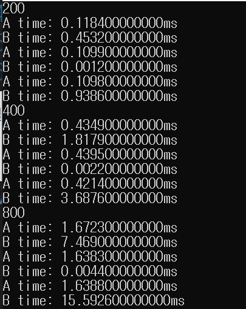
>
>#### 결론 ,요약
>
>> 각 n에 대해서 n이 커짐에 따라 O(n^2)을 따라가는 것을 알 수 있으며 
>>
>> 특이 케이스로 정렬되어있을 경우 
>>
>> 삽입정렬은 O(N^2)을 따르지 않으며 어떤 알고리즘보다 빠르다.
>>
>> 우선순위 큐 ADT는 임의의 데이터 항목이 삽입 될 수 있는 저장소로서 삭제 시에는 최소 키를 가진 항목부터 삭제 되는 데이터구조를 말한다.
>>
>> 일반적으로 어떤 정렬 알고리즘이 정렬 대상 개체를 위해 원래 제공된 메모리에 추가하여 오직 상수 메모리만을 사용한다면, 해당 정렬 알고리즘이 제자리에서 수행한다고 말한다. 
>>
>> 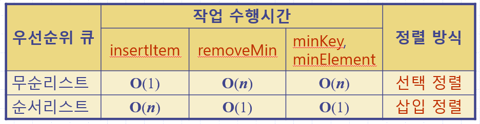
>>

### 🔀힙과 힙정렬

> #### 힙과 힙정렬 정의
>
> >힙 정렬은 병합정렬(Merge Sort)와 퀵 정렬(Quick Sort)만큼 빠른 정렬 알고리즘이다.
> >
> >**힙은 최솟값이나 최댓값을 빠르게 찾아내기 위해 완전 이진트리를 기반으로 하는 트리이다.**
> >
> >여기서 이진트리는 배열을 이용한 **순차트리** 형태로, 또는 연결리스트를 이용한 **연결트리** 형태로 구현할 수 있다.  
> >
> >순차트리로 구현된 힙을 **순차힙**, 연결트리로 구현된 힙을 **연결힙**이라고 부른다.
> >
> >최대 힙은 부모노드가 자식노드보다 큰 힙, 최소 힙은 부모노드가 자식노드보다 작은 힙을 말한다.
> >
> >힙 정렬을 수행하기 위해서는 힙 생성 알고리즘(Heapify Algorithm)을 사용한다.
> >
> >**힙 생성**은 **삽입식**(insertion)과 **상향식**(bottom-up)의 두 가지 방식이 있다. **삽입식**은 모든 키들이 미리 주
> >
> >어진 경우, 또는 키들이 차례로 주어지는 경우, 양쪽에 적용 가능하지만 **상향식**은 전자인 경우에만 적용 
> >
> >가능하다. 
> >
> >이 알고리즘은 '하나의 노드'에 대해 수행하는 것이다. 전제조건은 '하나의 노드를 제외하고는 최대 힙이 
> >
> >구성되어 있는 상태'라는 가정을 지닌다.
>
> #### 힙정렬 코드
>
> >삽입식에서의 항목을 넣으려면 들어온 item에 대해 정렬이 필요하다.
> >
> >힙 알고리즘에서의 upHeap 코드이다.
> >
> >```c
> >void upHeap(int i) {
> >	while (i > 1 && H[i] > H[i / 2]) {
> >		swap(&H[i], &H[i / 2]);
> >		i /= 2;
> >	}
> >}
> >```
> >
> >최대값을 지우고 재 정렬하고 나서 최대값을 반환하는 코드이다.
> >
> >```c
> >void downHeap(int i) {
> >	int index = i, child;
> >	while (index <= N / 2) {
> >		child = index * 2;
> >		if (child + 1 <= N && H[child] < H[child + 1]) {
> >			child++;
> >		}
> >		if (H[child] > H[index]) {
> >			swap(&H[child], &H[index]);
> >			index =child;
> >		}
> >		else {
> >			break;
> >		}
> >
> >	}
> >}
> >int removeMax() {
> >	int max = H[1];
> >	H[1] = H[N];
> >	N--;
> >	downHeap(1);
> >	return max;
> >}
> >```
> >
> >상향식 힙 생성을 위한 재귀 또는 비재귀 방식의 알고리즘 코드이다.
> >
> >```c
> >void rBuildHeap(int index) { //재귀
> >	if (index > N)
> >		return;
> >	rBuildHeap(2 * index);
> >	rBuildHeap(2 * index + 1);
> >	downHeap(index);
> >	
> >}
> >void buildHeap() {	//비재귀
> >
> >	for (int i = N / 2; i >= 1; i--)
> >		downHeap(i);
> >}
> >```
> >
> >
>
> #### 힙정렬 시간복잡도 및 특징
>
> >힙 생성 알고리즘의 시간복잡도는 한 번 자식 노드로 내려 갈 때마다 노드의 갯수가 2배씩 증가한다는 면에
> >
> >서O(log N)이다. (높이 차원) 이 때 데이터 데이터의 갯수가 N개 이므로 전체 트리를 힙 구조로 만드는 복잡
> >
> >도는**O(N*logN)**이다. 실제로는 특정한 숫자N에서 1/2만큼 힙 생성 알고리즘을 해도 힙 구조를 만들 수 있
> >
> >기 때문에 1/2*N *logN 인데 1/2 *N이 logN보다 증가율이 크기 때문에 **O(N)**으로 나타 낼 수 있다. 힙 정렬
> >
> >은 병합정렬과 다르게 별도로 추가적인 배열이 필요하지 않다는 점에서 메모리적으로 효율적이다.
> >
> >하지만 단순한 속도만 가지고 비교하면 퀵 정렬이 평균적으로 더 빠르기 때문에 힙 정렬이 일반적으로많이 
> >
> >사용되지는 않는다.
>

### 🔁합병정렬

>일반적인 방법으로 구현했을 때 이 정렬은 **안정 정렬** 에 속하며, **분할 정복 알고리즘**의 하나 이다.
>
>분할 정복(divide and conquer) 방법
>
>>문제를 작은 2개의 문제로 분리하고 각각을 해결한 다음, 결과를 모아서 원래의 문제를 해결하는 전략이다.
>>
>>분할 정복 방법은 대개 순환 호출을 이용하여 구현한다.
>
>과정 설명
>
>>리스트의 길이가 0 또는 1이면 이미 정렬된 것으로 본다. 그렇지 않은 경우에는
>>
>>정렬되지 않은 리스트를 절반으로 잘라 비슷한 크기의 두 부분 리스트로 나눈다.
>>
>>각 부분 리스트를 재귀적으로 합병 정렬을 이용해 정렬한다.
>>
>>두 부분 리스트를 다시 하나의 정렬된 리스트로 합병한다.
>
>합병 정렬은 다음의 단계들로 이루어진다.
>
>>**분할(Divide)**: 입력 배열을 같은 크기의 2개의 부분 배열로 분할한다.
>>
>>따라서 분할과정은 O(logN)이다. 
>>
>>**재귀(recur):** 부분 배열을 정렬한다. 부분 배열의 크기가 충분히 작지 않으면 순환 호출 을 이용하여 다시 분할 정복 방법을 적용한다.
>>
>>**통치(Combine):** 정렬된 부분 배열들을 하나의 배열에 합병한다.
>>
>>통치하는 과정에서 O(N)의 시간이 걸린다. 
>
>
>
>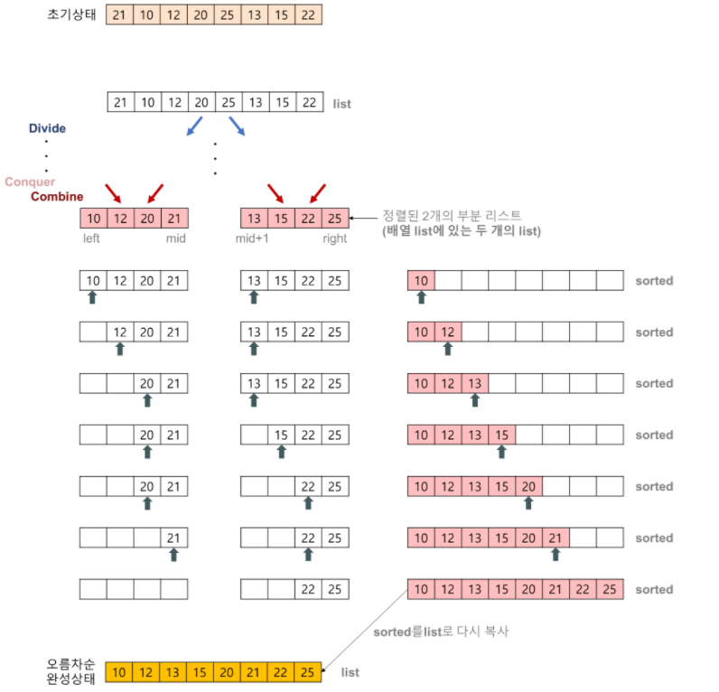
>
>### 합병 정렬(merge sort) 알고리즘의 특징
>
>#### 단점
>
>>만약 레코드를 배열(Array)로 구성하면, 임시 배열이 필요하다.
>>
>>제자리 정렬(in-place sorting)이 아니다.
>>
>>레크드들의 크기가 큰 경우에는 이동 횟수가 많으므로 매우 큰 시간적 낭비를 초래한다.
>
>#### 장점
>
>> 안정적인 정렬 방법
>>
>> 데이터의 분포에 영향을 덜 받는다. 즉, 입력 데이터가 무엇이든 간에 정렬되는 시간은 동일하다. (O(nlog₂n)로 동일)
>>
>> 만약 레코드를 연결 리스트(Linked List)로 구성하면, 링크 인덱스만 변경되므로 데이터의 이동은 무시할 수 있을 정도로 작아진다.
>>
>> > 제자리 정렬(in-place sorting)로 구현할 수 있다.
>>
>> 따라서 크기가 큰 레코드를 정렬할 경우에 연결 리스트를 사용한다면, 합병 정렬은 퀵 정렬을 포함한 다른 어떤 졍렬 방법보다 효율적이다.
>
>#### 합병 정렬 시간 복잡도
>
>>순환 호출의 깊이는 높이: k=log2N
>>
>>합병 단계의 비교연산은 최대 n번의 비교연산을 수행함
>>
>>따라서 순환 호출의 깊이 만큼의 합병단계* 각 합병 단계의 비교연산 =nlog2N
>
>#### 핵심코드
>
>``` c
>Node* merge(Node* L1, Node* L2) {
>
>	Node* mergedList = NULL;
>
>	if (L1 == NULL)
>		return L2;
>	if (L2 == NULL)
>		return L1;
>
>	if (L1->data < L2->data) {
>		mergedList = L1;
>		mergedList->next = merge(L1->next, L2);
>	}
>	else {
>		mergedList = L2;
>		mergedList->next = merge(L1, L2->next);
>	}
>
>	return mergedList;
>}
>
>Lists mg_partition(Node* L, int k) {
>
>	Node* L1;
>	Node* L2;
>
>	Node* horse = L;
>	Node* before = L;
>
>	int index = 0;
>	while (index < k / 2) {
>		before = horse;
>		horse = horse->next;
>		index++;
>	}
>
>	L1 = L;
>	L2 = horse;
>	before->next = NULL;
>
>	Lists lists = { L1, L2 };
>	return lists;
>}
>
>void mergeSort(Node** L) {
>
>	int k = findLength(*L);
>	if (k < 2)
>		return;
>
>	Lists lists = mg_partition(*L, k);
>	mergeSort(&lists.L1);
>	mergeSort(&lists.L2);
>	*L = merge(lists.L1, lists.L2);
>}
>```
>
>나머지 코드는 합병정렬 폴더 안에 기재.

### 🔂퀵 정렬

>퀵 정렬은 **불안정 정렬**에 속하며,  다른 원소와의 비교만으로 정렬을 수행하는 비교 정렬에 속한다.
>
>분할 정복 알고리즘의 하나로, 평균적으로 매우 빠른 수행속도를 자랑하는 정렬 방법이며
>
>합병 정렬(merge sort)과 달리 퀵 정렬은 리스트를 비균등하게 분할한다.
>
>분할 정복(divide and conquer) 방법
>
>>문제를 작은 2개의 문제로 분리하고 각각을 해결한 다음, 결과를 모아서 원래의 문제를 해결하는 전략이다.
>>
>>분할 정복 방법은 대개 순환 호출을 이용하여 구현한다.
>
>과정 설명
>
>>리스트 안에 있는 한 요소를 선택한다. 이렇게 고른 원소를 피벗(pivot) 이라고 한다.
>>
>>피벗을 기준으로 피벗보다 작은 요소들은 모두 피벗의 왼쪽으로 옮겨지고 피벗보다 큰 요소들은 모두 피벗의 오른쪽으로 옮겨진다. (피벗을 중심으로 왼쪽: 피벗보다 작은 요소들, 오른쪽: 피벗보다 큰 요소들)
>>
>>피벗을 제외한 왼쪽 리스트와 오른쪽 리스트를 다시 정렬한다.
>>
>>>부분 리스트에서도 다시 피벗을 정하고 피벗을 기준으로 2개의 부분 리스트로 나누는 과정을 반복한다.
>>>
>>>분할된 부분 리스트에 대하여 순환 호출 을 이용하여 정렬을 반복한다.
>>
>>리스트의 크기가 0이나 1이 될 때까지 반복한다.
>
>퀵정렬은 다음의 단계들로 이루어진다. (책 기준)
>
>>**분할(Divide)**: 입력 배열을 기준원소 p를 기준을 택하여 L을 세 부분으로 분할한다. 
>>
>>따라서 분할과정은 O(N)이다. 
>>
>>**재귀(recur):** 재귀하는 과정이 O(logN)이다. 
>>
>>**통치(Combine):** 통치하는 과정은 합치기만 하면 되므로 상수시간인 O(1)만큼 걸린다. 
>
>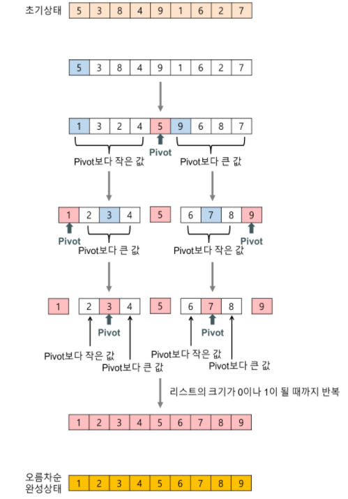
>
>### 퀵 정렬(quick sort) 알고리즘의 특징
>
>>#### 장점
>>
>>속도가 빠르다.
>>
>>시간 복잡도가 O(nlog₂n)를 가지는 다른 정렬 알고리즘과 비교했을 때도 가장 빠르다.
>>
>>추가 메모리 공간을 필요로 하지 않는다.
>>
>>퀵 정렬은 O(log n)만큼의 메모리를 필요로 한다.
>>
>>
>>
>>#### 단점
>>
>>정렬된 리스트에 대해서는 퀵 정렬의 불균형 분할에 의해 오히려 수행시간이 더 많이 걸린다.
>>
>>퀵 정렬의 불균형 분할을 방지하기 위하여 피벗을 선택할 때 더욱 리스트를 균등하게 분할할 수 있는 데이터를 선택한다.
>>
>>EX) 리스트 내의 몇 개의 데이터 중에서 크기순으로 중간 값(medium)을 피벗으로 선택한다.
>
>#### 퀵 정렬 의 시간복잡도
>
>>순환 호출의 깊이는 log2N
>>
>>순환호출 단계의 비교 연산 : 각 순환 호출에서는 전체 리스트의 대부분의 레코드를 비교
>>
>>평균 n번 정도의 비교가 이루어진다.
>>
>>순환 호출의 깊이* 각 순환 호출 단계의 비교 연산 = nlog2N
>>
>>다만 최악의 경우 리스트가 계속 불균형하게 나누어 지는 경우 
>>
>>순환 호출의 깊이는 N
>>
>>순환 호출 단계의 비교 연산은 평균 N번
>>
>>따라서 순환 호출의 깊이* 각 순환 호출 단계의 비교 연산 = N^2
>
>#### 핵심코드
>
>>```c
>>Partition inPlacePartition(int *L, int l, int r, int pivotIndex) {
>>	
>>	if(l >= r)
>>		return;
>>	
>>	int pivot = L[pivotIndex];
>>	
>>	//pivot 맨 오른쪽으로 
>>	swap(&L[pivotIndex], &L[r]);
>>	
>>	int toRight = l;
>>	int toLeft = r-1;
>>
>>	while(toRight <= toLeft) {
>>		
>>		//피벗보다 크거나 같은 값을 찾아서 
>>		while(L[toRight] <= pivot && toRight < r)
>>			toRight++;
>>		//피벗보다 작거나 같은 값을 찾아서	
>>		while(L[toLeft] >= pivot && toLeft >= l)
>>			toLeft--;
>>		
>>		//엇갈리지 않은 경우 값만 변경
>>		if(toRight <= toLeft)
>>			swap(&L[toRight++], &L[toLeft--]);
>>	}
>>	
>>	//엇갈린 경우 피벗과 swap
>>	swap(&L[r], &L[toRight]);
>>	
>>	// 3 way partitioning
>>	// a,b 시작은 pivot의 자리로 부터 
>>	// pivot과 같은 값을 찾으면 a는 좌로 b는 우로 한칸씩 늘려가며 swap
>>	int a = toRight;
>>	int b = toRight;
>>
>>	// 왼쪽 구간 확인
>>	// left 변수를 한칸씩 이동하며 pivot과 같은 값이면 가운데 구간으로 swap
>>	int left = l;
>>	while(left < a) {
>>		if(L[left] == pivot)
>>			swap(&L[left], &L[--a]);
>>		else
>>			left++;
>>	}
>>
>>	// 오른쪽 구간 확인
>>	// right 변수를 한칸씩 이동하며 pivot과 같은 값이면 가운데 구간으로 swap
>>	int right = r;
>>	while(right > b) {
>>		if(L[right] == pivot)
>>			swap(&L[right], &L[++b]);
>>		else
>>			right--;
>>	}
>>
>>	Partition partition = {a,b};
>>	return partition;	
>>}
>>
>>void inPlaceQuickSort(int *L, int l, int r) {
>>	
>>	if(l >= r)
>>		return;
>>	
>>	int pivotIndex = find_pivot_index(L, l, r);
>>	
>>	Partition partition = inPlacePartition(L,l,r,pivotIndex);
>>	
>>	inPlaceQuickSort(L, l, partition.L-1);
>>	inPlaceQuickSort(L, partition.R+1, r);
>>}
>>
>>```
>>
>>나머지는 퀵정렬에 기재 해둠.
>>
>>스택을 사용하여 비재귀로 구현는 퀵정렬 안에 quickStack로 구현해 두었다.
>>
>>
>
>#### 합병 정렬과 퀵정렬 비교
>
>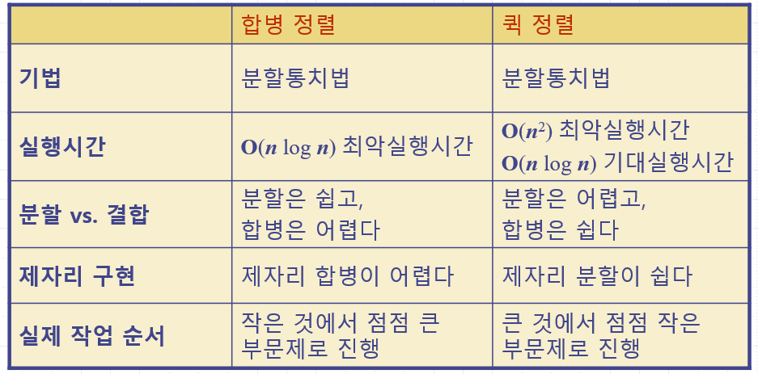
>

### ⏩계수 정렬(Counting Sort)

> 앞에서 다양한 정렬들을 알아보았고 속도가 가장 빠른 정렬 알고리즘은 O(NlogN)이 나오는 퀵 정렬, 
>
> 병합 정렬, 힙정렬이 빠를 것이다.
>
> 하지만 정렬하고자 하는 숫자가 **범위조건이 있는 경우** 한에 가장 빠른 알고리즘이 계수 정렬이다.
>
> 계수 정렬은 단순하게 크기를 기준으로 세는 알고리즘이다.
>
> ```c
> int main(){
>     int temp;
>     int count[6];
>     int array[30]={1,3,2,4,3,2,5,3,1,2
>                   3,4,4,3,5,1,2,3,5,2,
>                   3,1,4,3,5,1,2,1,1,1};
>     for(int i=1;i<=5;i++){
>         count[i]=0;
>     }
>     for(int i=0;i<30;i++){
>         count[array[i]]++;
>     }
>     for(int i=1;i<=5;i++){
>         if(count[i]!=0){
>             for(int j=0;j<count[i];j++)
>                 printf("%d",i);
>         }
>     }
> }
> ```
>
> 위에 보시는 것과 같이 해당하는 숫자만큼 세는 배열을 만들어 그 수만큼 출력을 반복하면 된다.
>
> 계수 정렬의 시간 복잡도는 O(N)이다.

### 🌳이진탐색트리

>이진 탐색 트리(binary search tree)는 이진 트리 기반의 탐색을 위한 자료 구조이다. 
>
>이진 탐색 트리의 조건에는 아래와 같이 4개의 조건이 있다.
>
>>모든 노드의 키는 유일하다.  
>>
>>왼쪽 서브 트리의 키들은 루트의  키보다 작다. .
>>
>>오른쪽 서브 트리의 키들은 루트의 키보다 크다. 
>>
>>왼쪽과 오른쪽 서브 트리도 이진 탐색 트리이다. ->
>>
>>순환적으로 정의되었다는 뜻이다. 즉 왼쪽 서브트리로 내려가든, 오른쪽 서브트리로 내려가든 동일한 법칙이 적용된다는 뜻이다.
>
>#### 탐색 알고리즘
>
>>루트 노드의 키와 사용자가 찾고자하는 값을 비교한다. 비교해서 같다면, 탐색을 마친다. 
>>
>>찾고자 하는 값이 루트 노드의 키 값보다 작으면, 탐색은 루트노드 기준으로 왼쪽 서브트리를 기준으로 다시 시작한다. 
>>
>>찾고자 하는 값이 루트 노드의 키 값보다 크면, 탐색은 루트노드 기준으로 오른쪽 서브트리를 기준으로 다시 처음과정을 반복한다.
>
>#### 삽입 알고리즘
>
>>삽입이란 특정 위치에 원하는 정보를 넣는 행위를 뜻한다. 
>>
>>특정 위치를 먼저 알아내야지만이 그 위치에 데이터를 삽입할 수 있다. 또한 내가 삽입하려는 데이터가 이미 존재하는 것일 수도 있기 때문에, 먼저 탐색을 해야만 한다. 
>>
>>결과적으로 탐색을 실패한 위치가 바로 새로운 노드를 삽입하는 위치가 된다.
>
>#### 삭제 알고리즘
>
>>이진 탐색 트리 관련 알고리즘 중 가장 복잡하다. 
>>
>>삭제도 먼저 삽입과 마찬가지로 탐색을 먼저 해야한다. 삭제하길 원하는 키 값이 트리 안의 어디에 위치하는지를 알아야 삭제할 수 있기 때문이다. 
>>
>>삭제시 발생할 수 있는 상황 3가지다.
>>
>>>##### 삭제하려는 노드가 단말노드일 경우
>>>
>>>>노드를 삭제하고, 부모노드의 링크필드를 null로 설정하는 작업으로 간단히 설정가능하다.
>>>>
>>>>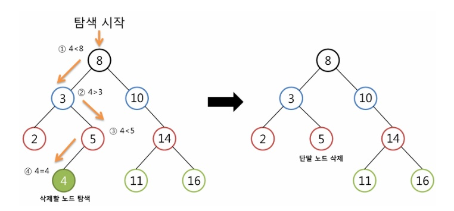
>>>>
>>>>
>>>
>>>##### 삭제하려는 노드가 하나의 서브트리만 가지는 경우
>>>
>>>>노드를 삭제하면 자식노드가 떨어져서 남겨진 자식노드를 삭제한 부모노드의 자리로 올려준다.
>>>>
>>>>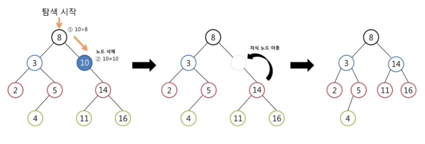
>>>
>>>##### 삭제하려는 노드가 두 개의 서브트리를 모두 가지고있는경우
>>>
>>>노드를 삭제하고 나면 부모노드의 자리를 자식노드에게 물려줄 때 왼쪽, 오른쪽 중 어느쪽에 물려줄 지 생각해야한다.
>>>
>>>이진탐색 트리의 특성에 따라서 삭제할 노드의 자리에 위치할 값은 왼쪽 서브 트리에 있는 노드들의 값보다 커야하고, 오른쪽 서브 트리에 있는 노드들의 키값보다는 작아야한다. 
>>>
>>>따라서 조상노드의 **왼쪽 서브 트리에서 가장 큰 자손 노드** 또는 **오른쪽 서브 트리에서 가장 작은 자손** 노드가 삭제할 노드의 자리에 올 수 있다.
>>>
>>>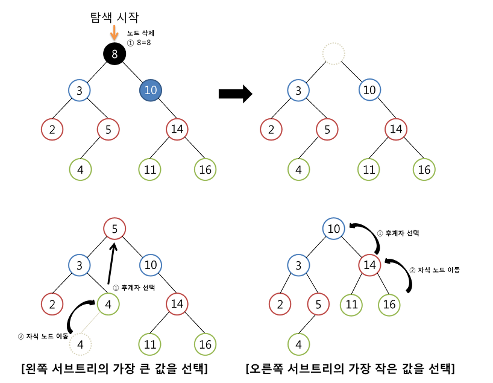
>
>#### 이진 탐색 트리의 시간복잡도 분석
>
>>이진 탐색 트리에서의 탐색, 삽입, 삭제 연산의 **시간 복잡도**는 트리의 높이를 h라고 했을 때 O(h)가 된다. 따라서 n개의 노드를 가지는 이진 탐색 트리의 경우, 균형 잡힌 이진 트리의 높이는 log_2n이므로 이진 탐색 트리 연산의 평균적인 경우의 시간 복잡도는 O(log_2n)이다.
>>
>>하지만 아래의 사진과 같이 이진트리가 경사진 이진트리이면,
>>
>>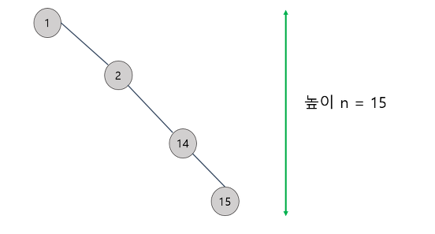
>>
>>경사 이진 트리의 경우 선형 탐색에 비하여 전혀 **시간적으로 이득이 없다.** 이러한 최악의 경우를 방지하기 위해 트리의 높이를 log_2n으로 한정시키는 균형 기법이 필요하다. 트리를 균형 있게 만드는 기법으로는 AVL 트리를 비롯한 여러 기법들이 존재한다.

### 🌲AVL트리

>일반적인 이진검색트리에서는 트리구조가 한 쪽으로 치우쳐지는 경우가 발생한다. 이진검색트리의 평균 검색
>
>속도는 O(logN)이지만 한 쪽으로 치우쳐진 경우에는 검색속도가 O(N)까지 저하될 수 있다. 
>
>이를 방지하기 위해 리밸런싱 작업을 수행하는 자료구조로는 AVL Tree, B-Tree, Red-Black Tree 등이 있으며 
>
>그 중 AVL Tree에 대해 알아보려고 한다.
>
>#### 불균현 상태
>
>>AVL Tree에서 불균형이 발생하면 리밸런싱을 한다.  
>>
>>AVL Tree에서는 하나의 노드를 기준으로 양쪽 서브트리의 높이 차이가 2 이상인 경우를 의미한다. 
>>
>>노드 11을 보면 11의 왼쪽자식이 존재하지 않으므로 왼쪽서브트리의 높이는 0이고 오른쪽 서브트리의 높이는 2입니다. 따라서 불균형이 발생했다. AVL Tree에서는 균형을 맞추기 위해 리밸런싱 작업을 수행한다.어떻게 리밸런싱을 할까?  바로 회전이라는 작업을 통해 이루어진다.
>>
>>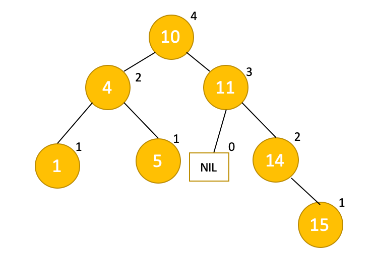
>
>#### 트리의 회전
>
>>정확히는 트리를 재구조화하는 작업이다. 
>>
>>재구조화된 결과가 마치 트리가 회전한 것처럼 되어서 회전이라고 부른다. 
>>
>>회전의 종류로는 left rotation 과 right rotation 이 있다.
>>
>>### left rotation
>>
>>>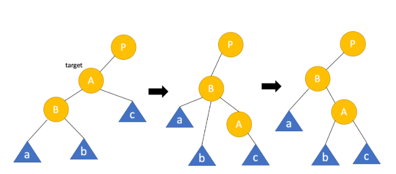
>>>
>>>노드 A의 위치를 노드B가 대신하고 , 그 과정에서 노드 B의 자식이 노드A의 자식으로 들어간다.
>>>
>>>이때 B의 자식노드b는 B보다 크고 A보다 작은것을 인지하면 어딜 들어가는지 알 수 있다.
>>
>>#### right rotation
>>
>>>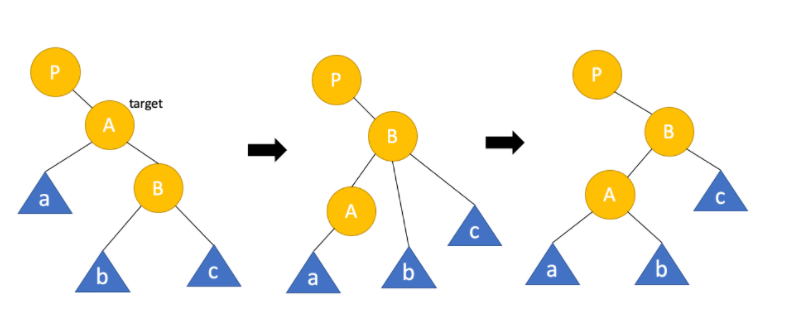
>>>
>>>left rotation과 동일하게 회전하며 B의 자식노드b가 A의 자식으로 간 것을 알면 된다.
>
>#### rotation case
>
>>left rotation과 right rotation을 언제 적용해야 할까? 총 4가지의 경우가 있다. 
>>
>>불균형이 발생한 노드는 A입니다.
>>
>>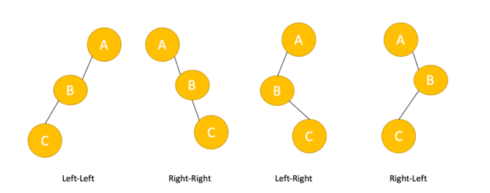
>>
>>LL : A노드 기준으로 right rotation을 진행한다.
>>
>>RR: 인 경우에는 A노드를 기준으로 left rotation을 진행한다.
>>
>>LR: 노드 B를 기준으로 left rotation을 진행한 후 노드 A를 기준으로 right rotation을 진행한다.
>>
>>RL: 우선 노드 B를 기준으로right rotation을 진행한 후 노드 A를 기준으로  left rotation을 진행한다.
>
>#### 삽입연산
>
>>이진탐색트리에서 처럼 삽입연산은 동일하며 그 이후에 불균형 여부를 검사한다.
>>
>>불균형이 발생되면 case에 따라 회전연산을 적용한다.
>
>#### 삭제연산
>
>>이진탐색트리에서 처럼 삭제연산도 동일하며 그 이후에 불균형 여부를 검사한다.

### 📕해시테이블

>해시 테이블은 연관 배열 구조를 이용하여 키에 결과 값을 저장하는 자료구조이다.
>
>따라서 키1개 와 값 1개가 1:1로 연관되어 있는 자료구조이다. 따라서 키를 이용하여 값을 도출 할 수 있다.
>
>연관배열 구조는 다음을 지원한다.
>
>>- 키(key)와 값(value)이 주어졌을 때, 연관 배열에 그 두 값(key & value)을 저장하는 명령
>>- 키(key)가 주어졌을 때, 연관되는 값(value)을 얻는 명령
>>- 키(key)와 새로운 값(value)이 주어졌을 때, 원래 키에 연관된 값(value)을 새로운 값(value)으로 교체하는 명령
>>- 키(key)가 주어졌을 때, 그 키(key)에 연관된 값(value)을 제거하는 명령
>
>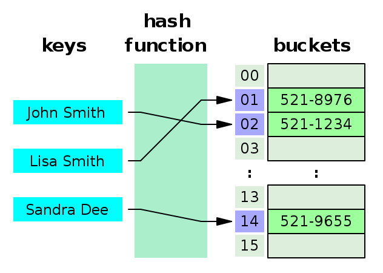
>
>해시 테이블은 키, 해시함수, 해시(Hash), 값(value), 저장소(Bucket, Slot)로 이루어져 있다.
>
>키는 해시함수를 통해 해시로 변경이 되며 해시는 값과 매칭되어 저장소에 저장이 된다.
>
>해시: 해시 함수의 결과물이며, 저장소에서 값과 매칭되어 저장된다.
>
>값(Value): 저장소에 최종적으로 저장되는 값으로 키와 매칭되어 저장,삭제,검색,접근이 가능해야 한다.
>
>해쉬 함수는 보통 두 함수의 복합체로 명세한다.
>
>>해시코드맵 h1 : keys->integers 
>>
>>압축맵 h2: integers->[0,M-1]
>
>#### 해시코드맵
>
>>**메모리주소**: total이라는 변수가 저장되어 있는 **메모리 주소**를 정수로 재해석 한다.
>>
>>하지만 문자열 키에는 적용 곤란한데 그 이유는 동일한 값의 수치나 문자열이 두군데 이상의 메모리에 존재할 경우 각 주소에 따라 상이한 수로 매핑 될 수 있기 때문이다.
>>
>>**정수 캐스트** : 순수 toal이라는 **키의 비트값**을 정수로 재해석 하는 것이다. 
>>
>>**요소합**: 키의 비트들을 고정길이의 요소들로 분할한 후 각 요소를 합하는 것이다.
>>
>>예를 들어 total에서 각 알파벳을 해체한 후에 더한값을 나타낸 것이다. 하지만 문자열같이 문자의 순서에 의미가 있는 키에는 문자열이 달라고 안의 값이 같으면 동일한 곳으로 매핑하기 때문이다.
>>
>>**다항 누적**: 위에서는 stop 과 tops 는 같은 값이 나왔지만 다항 누적은 각 자리값에 해당하는 키에 z^n을 곱해 별도 계산을 부과하여 다른값이 나오게 한다. 
>
>#### 압축맵
>
>>**나머지셈 : ** h2(k)=|k|%M
>>
>>**승합제** : h2(k)=|ak+b|%M
>>
>>일반적으로 M은 소수를 택하며 a 값과 M 값은 서로서 이어야한다.
>
>#### Hash Collision (해시  충돌)
>
>>해시테이블은검색,삭제,삽입 과정에서 모두 평균적으로 O(1)의 시간복잡도를 가지고 있기 때문에 
>>
>>자료구조의 효율성 측면에서 매우 우수하다고 볼 수 있다. 하지만 서로 다른 두 개 이상의 유한한 값이 동일한 출력값을 가지게 된다는 것이다.
>
>#### 해시충돌 해결방법
>
>#### 1.분리연쇄법 (chaining)
>
>>#### 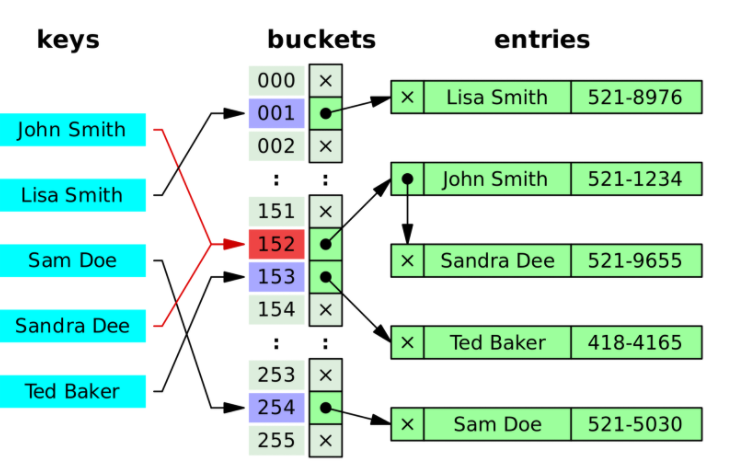
>>
>>
>>
>>해시 충돌을 일으키는 두 값에 대해 연결리스트로 연결하는 방법.
>>
>>#### 장점
>>
>>>1) 한정된 저장소(Bucket)을 효율적으로 사용할 수 있다.
>>>2) 해시 함수(Hash Function)을 선택하는 중요성이 상대적으로 적다.
>>>3) 상대적으로 적은 메모리를 사용한다. 미리 공간을 잡아 놓을 필요가 없다.
>>
>>#### 단점
>>
>>>1) 한 Hash에 자료들이 계속 연결된다면(쏠림 현상) 검색 효율을 낮출 수 있다.
>>>2) 외부 저장 공간을 사용한다.
>>>3) 외부 저장 공간 작업을 추가로 해야 한다.
>>
>>#### Chaining 시간 복잡도
>>
>>>해시 테이블의 저장소(Bucket)의 길이를 ‘n’, 키(key)의 수를 ‘m’이라고 가정했을 때, 평균적으로 저장소에서 1개의 hash당 (m/n)개의 키가 들어있다. 이를 ‘α’라고 정의한다.
>>>
>>>m/n = α (1개의 Hash당 평균적으로 α개의 키가 들어있다.)
>>>
>>>#### 삽입
>>>
>>>>충돌이 일어났을 때, 해당 해시(Hash)가 가진 연결리스트의 Head에 자료를 저장할 경우, O(1)의 시간복잡도를 가진다. 해당 해시(Hash)를 산출하고 저장하면서 기존 값(value)를 연결하는 행위만 하면 되기 때문이다.
>>>>
>>>>반면 Tail에 자료를 저장할 경우, O(α)의 시간 복잡도를 가진다. 해당 해시(Hash)를 저장할 때 모든 연결리스트를 지나서 Tail에 접근해야 하기 때문이다. 최악의 경우, O(n)의 시간 복잡도를 가진다. 한 개의 해시(Hash)에 모든 자료가 연결되어 있을 수 있기 때문이다.
>>>
>>>#### 삭제 탐색
>>>
>>>>삭제와 검색은 시간 복잡도 측면에서 비슷한 개념을 공유한다. 산출된 Hash의 연결리스트를 차례로 살펴보아야 하므로 O(α)의 시간 복잡도를 가진다. 최악의 경우 O(n)의 시간복잡도를 가진다. 한 개의 해시(Hash)에 모든 자료가 연결되어 있을 수 있기 때문이다. 이 경우 모든 자료를 다 살펴보아야 한다.
>
>#### 2.개방주소법(Open Addressing)
>
>>chaining과는 달리 비어있는 해시(hash)를 찾아 데이터를 저장하는 기법이다. 
>>
>>개방주소법에서의 해시테이블은 1개의 해시와 1개의 값(value)가 매칭되어 있는 형태로 유지된다.
>>
>>따라서 비어있는 해시를 찾아 저장하는 방법을 Open Addressing 라고 한다.
>>
>>#### 개방주소법 종류
>>
>>>- **선형 탐색**(Linear Probing): 다음 해시(+1)나 n개(+n)를 건너뛰어 비어있는 해시에 데이터를 저장한다. -> 충돌 항목들은 군집화하며, 이후의 충돌에 의해 더욱 긴 조사열로 군집한다.(1차 군집화)
>>>
>>>- **제곱 탐색**(Quadratic Probing): 충돌이 일어난 해시의 제곱을 한 해시에 데이터를 저장한다.
>>>
>>>  -> M이 소수가 아니거나 버켓 배열이 반이상 차면,비어있는 버켓이 남아 있더라도 찾지 못할수있다.
>>>
>>>- **이중 해시**(Double Hashing): 다른 해시함수를 한 번 더 적용한 해시에 데이터를 저장한다.
>>>
>>>  -> 다른 함수가 얼만큼 뒤에 저장할지 지정한다. h`(k)는 M과 서로소 이어야 하며 
>>>
>>>   h`(k)= q-(k%q) or 1+(k%q) 를 사용한다.
>>
>>#### 장점
>>
>>>1)또 다른 저장공간 없이 해시테이블 내에서 데이터 저장 및 처리가 가능하다.
>>>2) 또 다른 저장공간에서의 추가적인 작업이 없다.
>>
>>#### 단점
>>
>>>1) 해시 함수(Hash Function)의 성능에 전체 해시테이블의 성능이 좌지우지된다.
>>>
>>>2) 데이터의 길이가 늘어나면 그에 해당하는 저장소를 마련해 두어야 한다.
>>>
>>>3)군집화하는 경우가 많다.
>>
>>#### 개방주소법 갱신
>>
>>>삭제 작업을 진행하고 나서 그 공간을 비워두기만 한다면 그 뒤에 저장된 키들을 찾을때 못 찾는 경우가 나온다. 따라서 비어 있는 것과 사용중인 것 , 두 종료만 구분하는 것이 아니라 세 번째 종류로 비활성화된 버켓을 정의하는 전략이다. 탐색도중에 비활성화된 버켓을 만나면 사용중인것처럼 탐색을 진행하며 삽입을 할 때에는 비어있는 것처럼 삽입을 진행하면 된다. 
>>
>>#### 개방 주소법 시간복잡도
>>
>>>Chaining 에서 정의한 ‘α’를 Open Addressing 에서도 정의하자면, 해시 테이블의 저장소(Bucket)의 길이를 ’n’, 키(key)의 수를 ‘m’이라고 가정했을 때, ‘α’는 1보다 작거나 같다. 저장소 1개 버킷 당 1개의 값(value)만 가지기 때문이다.
>>>
>>>m/n = α (α <= 1)
>>>
>>>#### 삽입,삭제 ,검색
>>>
>>>>해시함수를 통해 얻은 Hash가 비어있지 않으면 다음 버킷을 찾아가야 한다. 이 찾아가는 횟수가 많아지면 많아질 수록 시간복잡도가 증가한다. 최상의 경우 O(1) ~ 최악의 경우 (O(n)).
>>>>
>>>>따라서 Open Addressing에서는 비어있는 공간을 확보하는 것(= 저장소가 어느 정도 채워졌을 때 저장소의 사이즈를 늘려주는 것)이 필요하다.
>>>>
>>>>최악의 경우 저장소를 모두 살펴보아야 하는 경우가 생길 수 있다.(O(n))
>
>#### 적재율
>
>> 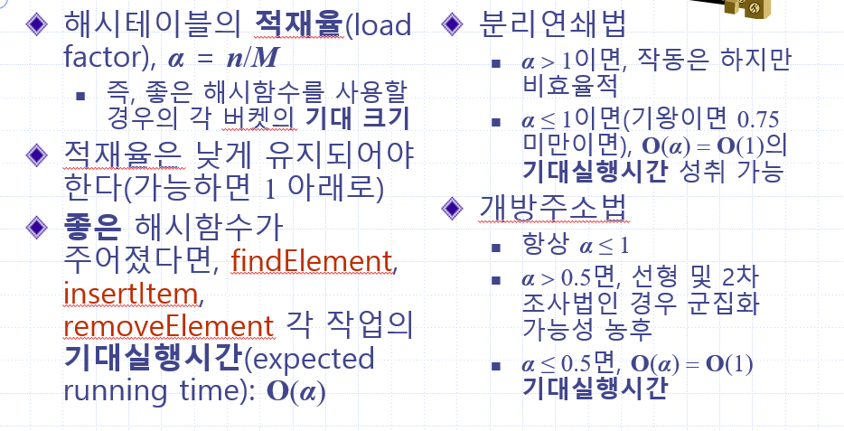
>
>## Hash Table Data Structure의 단점
>
>>- 순서가 있는 배열에는 어울리지 않는다.
>>  : 상하관계가 있거나, 순서가 중요한 데이터의 경우 Hash Table은 어울리지 않다. 순서와 상관없이 key만을 가지고 hash를 찾아 저장하기 때문이다.
>>- 공간 효율성이 떨어진다.
>>  : 데이터가 저장되기 전에 미리 저장공간을 확보해 놓아야 한다. 공간이 부족하거나 아예 채워지지 않은 경우가 생길 가능성이 있다. 또 한 적재율은 해시테이블의 성능을 좌우한다. 
>>- Hash Function의 의존도가 높다.
>>  : 평균 데이터 처리의 시간복잡도는 O(1)이지만, 이는 해시 함수의 연산을 고려하지 않는 결과이며 사전에 삽입된 모든 키가 충돌한 경우에는 O(n)시간이 걸린다. 

### 🔱DFS,BFS 그래프 순회

>그래프의 정점을 모두 한번씩 방문하는 알고리즘을 순회 알고리즘이라고 한다.
>
>순회 알고리즘에는 크게 두가지가 있는데 하나는 깊이 우선 탐색(DFS)이고, 너비 우선 탐색(BFS)이다.
>
>#### DFS
>
>>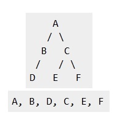
>>
>>인접한 정점이 존재한다면 계속 인접한 정점으로 탐색하는 기법이다.
>>
>>만약 인접한 정점이 존재하지 않는다면 이전에 있었던 정점으로 돌아가 인접한 정점을 탐색한다.
>>
>>재귀함수, 정점의 방문 여부를 체크하는 Visted배열, 연결리스트로 구현하였다.
>
>#### BFS
>
>>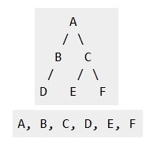
>>
>>너비 우선 탐색은 인접한 정점을 발견하면 모든 인접한 정점을 탐색하는 기법이다.
>>
>>나머지는 DFS와 비슷하나 인접한 모든 정점을 담아둘 큐를 필요로 한다.
>>
>>큐,정점의 방문 여부를 체크하는 Visted배열, 연결리스트로 구현하였다.
>>
>>```c
>>void DFS(int start) {
>>
>>	graph[start]->visited = 1;
>>	printf("%d\n", graph[start]->nodeNumber);
>>	Edge *runner = graph[start]->list->next;
>>	int visited;
>>	while (runner != NULL) {
>>		visited= runner->nodeNumber;
>>		if (graph[visited]->visited == 0)
>>			DFS(visited);
>>		runner = runner->next;
>>	}
>>}
>>```
>>
>>
>>
>>```c
>>void BFS(int start,int n) {
>>	enqueue(start);
>>	visited[start] = 1;
>>	while (!isEmpty()) {
>>		int nodeStart = dequeue();
>>		printf("%d\n", nodeStart);
>>		for (int i = 1; i <= n; i++) {
>>			if (visited[i] == 0 && graph[nodeStart][i] == 1) {
>>				visited[i] = 1;
>>				enqueue(i);
>>			}
>>
>>		}
>>	}
>>}
>>```
>

### 🔁위상 정렬(Topology Sort)

>위상 정렬은 순서가 정해져 있는 작업을 차레로 수행해야 할때  그 순서를 결정해주기 위해 사용하는
>
>알고리즘이다.
>
>여기서 위상정렬은 DAG(Directed Acyclic Graph) 즉 사이클이 없는 방향 그래프에서만 사용 한다.
>
>따라서 위상정렬은 현재 그래프는 위상 정렬이 가능한지 , 위상 정렬이 가능하다면 그 결과는
>
>무엇인지를 나타낸다.
>
>#### 위상 정렬 순서도
>
>>1. 진입차수가 0인 정점을 큐에 삽입한다.
>>
>>2. 큐에서 원소를 꺼내 연결된 모든 간선을 제거한다.
>>
>>3. 간선 제거 이후에 진입차수가 0이 된 정점을 큐에 삽입한다.
>>
>>4. 큐가 빌 때까지 2~3번 과정을 반복하고 모든 원소를 방문하기 전에 큐가 비면
>>
>>   사이클 존재, 모든 원소를 방문 하였으면 큐에서 꺼낸 순서가 위상 정렬이다.
>
>```c
>void topologicalSort() {
>	int *in = (int*)malloc(n * sizeof(int));
>	topOrder = (int*)malloc((n + 1) * sizeof(int));
>	Q = (int*)malloc(n * sizeof(int));
>
>	for (int i = 0; i < n; i++) {
>		in[i] = graph->vertex[i]->indegree;
>		if (in[i] == 0)
>			enqueue(i);
>	}
>	int t = 1;
>	while (!isEmpty()) {
>		int u = dequeue();
>		topOrder[t] = u;
>		t++;
>		Node *Runner = graph->vertex[u]->outEdge->next;
>		while (Runner != NULL) {
>
>			int w = graph->edge[Runner->data]->destination;
>			in[w] = in[w] - 1;
>			if (in[w] == 0)
>				enqueue(w);
>			Runner = Runner->next;
>		}
>
>	}
>	if (t <= n)
>		topOrder[0] = 0;
>	else
>		topOrder[0] = 1;
>}
>```

### 🧲합집합 찾기 or 부모 찾기(Union-Find)

>합집합 찾기는 대표적인 그래프 알고리즘이다.  구체적으로 여러 개의 노드가 존재 할때 두개의 노드를 
>
>선택해서, 현재 이 두 노드가 서로 같은 그래프에 속하지는 판별하는 것이다.
>
>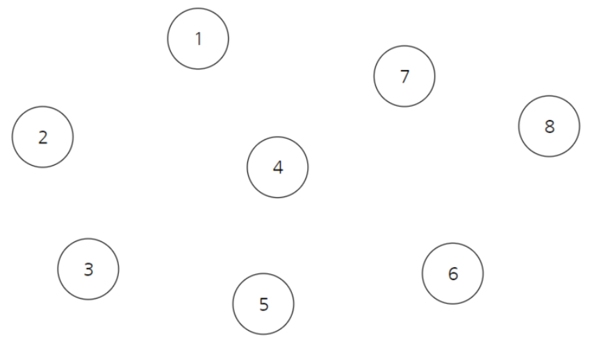
>
>위와 같이 여러개의 노드가 있을때 모든 값이 자기 자신을 가르키는 배열을 만든다.
>
>첫번째 행은 "노드 번호"를 의미하고 두번째 행은 "부모 노드 번호"를 의미한다.
>
>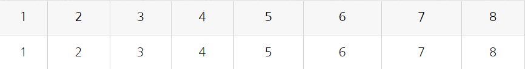
>
>만약 이때 1과 2 부모를 합칠 떄는 일반적으로 더 작은 값 쪽으로 합친다. 이것을 우리는 합침(Union) 
>
>이라고 한다.
>
>```c
>int getParent(int x){
>	if(parent[x]==x) return x;
>	return parent[x]= getParent(parent[x]);
>}
>void unionParent(int parent[], int a, int b){
>    a=getParent(parent,a);
>    b=getParent(parent,b);
>    if(a<b) parent[b]=a;
>    else parent[a]=b;
>}
>int findParent(int parent[],int a,int b){
>    a=getParent(parent,a);
>    b=getParent(parent,b);
>    if(a==b) return 1;
>    else return 0;
>}
>```
>
>위에 보이는 코드는 부모를 얻는 코드,부모를 합치는 코드, 그리고 부모가 같은 여부를 판단 하는 코드이다.

### 🚃크루스칼 알고리즘(Kruskal Algorithm)

>크루스칼 알고리즘은 가정 적은 비용으로 모든 노드를 연결하는 알고리즘이다.
>
>즉 최소 비용 신장 트리를 만들기 위한 대표적인 알고리즘이다.
>
>#### 간선을 거리가 짧은 순서대로 그래프에 포함 시키는 것
>
>크루스칼 알고리즘의 순서도
>
>>1. 정렬된 순서에 맞게 그래프에 포함시킨다.
>>2. 포함시키기 전에 사이클 테이블을 확인한다.
>>3. 사이클을 형성하는 경우 간선을 포함하지 않는다.
>
>사이클은 위에서 배운 Union을 통해 부모를 찾는것으로  확인한다.
>
>```c
>void kruskal() {
>
>	// 큐에 모든 간석 넣기 
>	for (int i = 0; i<m; ++i)
>		enqueue(G->edgeList[i]);
>
>	// 큐 힙 구조화 
>	buildHeap();
>
>	// 큐가 비어있지 않으면 반복 
>	while (!isEmpty()) {
>
>		// 큐에 남은 간선들 중 가장 작은 가중치의 간선 dequeue  
>		Edge minEdge = removeMin();
>
>		// 해당 간선을 연결해도 사이클이 안생길 경우 실행
>		if (!isCycle(minEdge)) {
>
>			// 간선의 양쪽 값을 나타내는 변수 
>			int vertexNum, oppositeVertexNum;
>
>			vertexNum = minEdge.vertexNum1;
>			oppositeVertexNum = minEdge.vertexNum2;
>
>			MST[indexOfMST++] = minEdge.weight;
>			totalWeight += minEdge.weight;
>
>			unionParent(vertexNum, oppositeVertexNum);
>		}
>	}
>}
>```
>
>
>
>크루스칼 알고리즘은 사실상 정렬 알고리즘과 Union 알고리즘의 합이라고 할 수 있으므로 
>
>정렬 알고리즘의 시간복잡도와 동일하다.

### 🚌다익스트라(Dijkstra) 알고리즘

>다익스트라 알고리즘은  최단경로 탐색 알고리즘이다.
>
>다익스트라 알고리즘은 음의 간선을 포함 할 수 없지만 현실세계에서는 음의 간선이 존재하지 않기 
>
>때문에 다익스트라는 현실세계에서 사용하기 용이하다.
>
>### 다익스트라 순서도
>
>>1. 출발 노드를 설정한다.
>>2. 출발 노드를 기준으로 각 노드의 최소 비용을 저장한다.
>>3. 방문하지 않을 노드 중에서 가장 비용이 적은 노드를 선택한다.
>>4. 해당 노드를 거쳐서 특정한 노드로 가는 경우를 고려하여 최소 비용을 갱신한다.
>>5. 위의 3~4번 과정을 반복한다.
>
>```c
>void DijkstraShortestPaths() {
>	for (int i = 1; i <= n; i++)
>		G->vertex[i]->d = MAX;
>
>	G->vertex[s]->d = 0;
>	for (int i = 1; i <= n; ++i)
>		enqueue(i, G->vertex[i]->d);
>
>	buildHeap();
>
>	while (!isEmpty()) {
>		int u = removeMin();
>		Edge *Runner = G->vertex[u]->includeEdge->next;
>		while (Runner != NULL) {
>			int z = Runner->EndvertexNum;
>
>			if (isInQueue(z)) {
>				if (G->vertex[u]->d + getWeight(u, z) < G->vertex[z]->d) {
>					G->vertex[z]->d = G->vertex[u]->d + getWeight(u, z);
>					replaceKey(z, G->vertex[z]->d);
>				}
>			}
>			Runner = Runner->next;
>		}
>	}
>}
>```

### 🚋플로이드 와샬(Floyd Warshall) 알고리즘

>다익스트라 알고리즘은 하나의 정점에서 출발하였을때 다른 모드 정점으로의 최단 경로를 구하는 알고리즘이다.
>
>하지만 만약에 모든 정점에서 모든 정점으로 최단 경로를 구하고 싶다면 프로이드 와샬 알고리즘을 쓴다.
>
>플로이드 와샬 알고리즘은 기본적으로 '거쳐가는 정점'을 기준으로 알고리즘을 수행한다.
>
>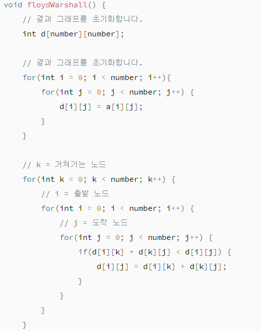
>
>

#### 시험공부 하면서 느낌점들

>모든 비교정렬의 하한가의 수행시간 오메가(nlogn) 시간을 가진다.
>
>이말은 즉슨 아무리 빨라도 nlogn 보다 실행시간이 빠르지 않다는 것을 의미한다.
>
>
>
>5개의 수를 비교할때 최악의 경우 몇번 비교를 하는가에 대한 질문으로
>
>5개의 비교 정렬하는 결정트리의 리프의 수는 5!이며 트리의 높이는 최소 log5!이다.
>
>따라서 6< log5! <7 이므초 최소 7번의 비교가 필요하다. 
>
>
>
> 비교정렬 알고리즘 가운데 
>
>선택 정렬, 삽입 정렬, 합병 정렬은 **안정적**이지만 힙 정렬과 퀵 정렬은 **비안정적**이다.
>
>여기서 안정적이라는 것은 두개의 항목에 대해 정렬전에 앞에 있던 항목이 정렬 후에도 앞에 있는 것이 보장된다면 그것을 안정적이라고 한다. 
>
>힙 정렬 알고리즘이 비안정적인 이유는 힙 재구성 과정에서 두 개의 동일한 키들의 원래 순서가
>
>뒤바뀔 수 있기 떄문이다. 
>
>퀵 정렬 알고리즘은 두 개의 동일한 키들의 원래 순서가 바뀔 수 있기 때문이다. 

#### 인터넷 보며 배운 용어, 정의들

>ADT= 추상형 자료 구조형의 약자 (Abstract Data Type)
>PQ=우선순위 큐(Priority Queue)
>
>우선순위 큐랑 일반적인 큐랑 차이점은 일반 큐는 FIFO 특성을 띄는 반면에 우선순위 큐는 우선순위가 제일 높/낮은 데이터가 먼저 나가는 것을 말한다.
>
>힙 자체는 완전 이진트리인데 힙을 구현하는 도구로는 배열이 적당한다. 
>
>완전이진트리: 데이터라 루트노드부터 시작해서 자식노드가 왼쪽자식 노드,오른쪽 자식 노드로 차근차근 들어가는 구조의 이진트리
>
>알고리즘의 실행시간을 두 부분으로 나누면
>
>1. 입력값의 크기에 따라 알고리즘의 실행시간을 검증해볼 수 있다.
>2. 입력값의 크기에 따른 함수의 증가량, 우리는 이것을 성장률이라고 부른다.
>     이때 중요하지 않는 상수와 계수들을 제거하면 알고리즘의 실행시간에서 중요한
>     성장률에 집중할 수있는데 이것을 점금적 표기법(Asymptotic notation)이라 부른다.
>     여기서, 점근적이라는 의미는 가장 큰 영향을 주는 항만 계산한다는 의미다.
>
>점근적 표기법은 다음 세가지가 있는데 시간복잡도를 나타내는데 사용된다.
>
>- 최상의 경우 : 오메가 표기법 (Big-Ω Notation)
>- 평균의 경우 : 세타 표기법 (Big-θ Notation)
>- 최악의 경우 : 빅오 표기법 (Big-O Notation)
>
>평균인 세타 표기를 하면 가장 정확하고 좋겠지만 평가하기가 까다롭다.
>그래서 최악의 경우인 빅오를 사용하는데 알고리즘이 최악일때의 경우를 판단하면 평균과 가까운 성능으로 예측하기 쉽기때문이다.
>
>## 빅오 표기법(Big-O)
>
>빅오 표기법은 불필요한 연산을 제거하여 알고리즘분석을 쉽게 할 목적으로 사용된다.
>
>Big-O로 측정되는 복잡성에는 시간과 공간복잡도가 있는데
>
>- 시간복잡도는 입력된 N의 크기에 따라 실행되는 조작의 수를 나타낸다.
>
>- 공간복잡도는 알고리즘이 실행될때 사용하는 메모리의 양을 나타낸다.
>요즘에는 데이터를 저장할 수 있는 메모리의 발전으로 중요도가 낮아졌다.
>
>- 아래는 대표적인 Big-O의 복잡도를 나타내는 표이다.
>
>- 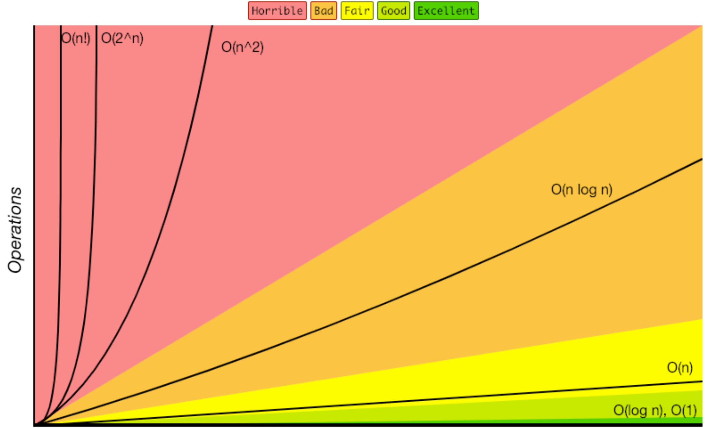
>
>## 시간복잡도
>
>시간복잡도의 가장 간단한 정의는 알고리즘의 성능을 설명하는 것.
>다른의미로는 알고리즘을 수행하기 위해 프로세스가 수행해야하는 연산을 수치화 한것이다.
>왜 실행시간이 아닌 연산수치로 판별할까? 위에도 설명했지만 명령어의 실행시간은 컴퓨터의 하드웨어 또는 프로그래밍 언어에 따라 편차가 크게 달라지기 때문에 명령어의 실행 횟수만을 고려하는 것이다.
>
>시간복잡도에서 중요하게 보는것은 가장큰 영향을 미치는 n의 단위이다.
>
>```
>1             O(1)   --> 상수
>2n + 20       O(n)   --> n이 가장 큰영향을 미친다.
>3n^2          O(n^2) --> n^2이 가장 큰영향을 미친다.
>```
>
>시간복잡도의 문제해결 단계를 나열 하면 아래와같다.
>
>```
>O(1) – 상수 시간 : 문제를 해결하는데 오직 한 단계만 처리함.
>O(log n) – 로그 시간 : 문제를 해결하는데 필요한 단계들이 연산마다 특정 요인에 의해 줄어듬.
>O(n) – 직선적 시간 : 문제를 해결하기 위한 단계의 수와 입력값 n이 1:1 관계를 가짐.
>O(n log n) : 문제를 해결하기 위한 단계의 수가 N*(log2N) 번만큼의 수행시간을 가진다. (선형로그형)
>O(n^2) – 2차 시간 : 문제를 해결하기 위한 단계의 수는 입력값 n의 제곱.
>O(C^n) – 지수 시간 : 문제를 해결하기 위한 단계의 수는 주어진 상수값 C 의 n 제곱.
>```
>
>아래표는 실행시간이 빠른순으로 입력 N값에 따른 서로 다른 알고리즘의 시간복잡도이다.
>
>| Complexity | 1    | 10      | 100                             |
>| :--------- | :--- | :------ | :------------------------------ |
>| O(1)       | 1    | 1       | 1                               |
>| O(log N)   | 0    | 2       | 5                               |
>| O(N)       | 1    | 10      | 100                             |
>| O(N log N) | 0    | 20      | 461                             |
>| O(N^2)     | 1    | 100     | 10000                           |
>| O(2^N)     | 1    | 1024    | 1267650600228229401496703205376 |
>| O(N!)      | 1    | 3628800 | 화면에 표현할 수 없음!          |
>
>### O(1) : 상수
>
>아래 예제 처럼 입력에 관계없이 복잡도는 동일하게 유지된다.
>
>```
>def hello_world():
>        print("hello, world!")
>```
>
>### O(N) : 선형
>
>입력이 증가하면 처리 시간또는 메모리 사용이 선형적으로 증가한다.
>
>```
>def print_each(li):
>    for item in li:
>        print(item)
>```
>
>### O(N^2) : Square
>
>반복문이 두번 있는 케이스
>
>```
>def print_each_n_times(li):
>    for n in li:
>        for m in li:
>            print(n,m)
>```
>
>### O(log n) O(n log n)
>
>주로 입력 크기에 따라 처리 시간이 증가하는 정렬알고리즘에서 많이 사용된다.
>다음은 이진검색의 예이다.
>
>```
>def binary_search(li, item, first=0, last=None):
>	if not last:
>		last = len(li)
>
>	midpoint = (last - first) / 2 + first
>
>	if li[midpoint] == item:
>		return midpoint
>
>	elif li[midpoint] > item:
>		return binary_search(li, item, first, midpoint)
>
>	else:
>		return binary_search(li, item, midpoint, last)
>```
>
>## 시간복잡도를 구하는 요령
>
>각 문제의 시간복잡도 유형을 빨리 파악할 수 있도록 아래 예를 통해 빠르게 알아 볼수 있다.
>
>- 하나의 루프를 사용하여 단일 요소 집합을 반복 하는 경우 : O (n)
>- 컬렉션의 절반 이상 을 반복 하는 경우 : O (n / 2) -> O (n)
>- 두 개의 다른 루프를 사용하여 두 개의 개별 콜렉션을 반복 할 경우 : O (n + m) -> O (n)
>- 두 개의 중첩 루프를 사용하여 단일 컬렉션을 반복하는 경우 : O (n²)
>- 두 개의 중첩 루프를 사용하여 두 개의 다른 콜렉션을 반복 할 경우 : O (n * m) -> O (n²)
>- 컬렉션 정렬을 사용하는 경우 : O(n*log(n))
>
>
>
>## 정렬 알고리즘 비교
>
>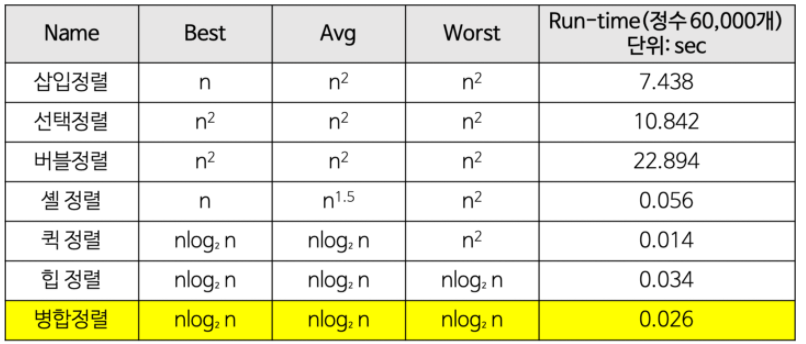
>
>| Sorting Algorithms | 공간 복잡도 | 시간 복잡도 |             |             |
>| :----------------- | :---------- | :---------- | :---------- | ----------- |
>|                    | 최악        | 최선        | 평균        | 최악        |
>| Bubble Sort        | O(1)        | O(n)        | O(n2)       | O(n2)       |
>| Heapsort           | O(1)        | O(n log n)  | O(n log n)  | O(n log n)  |
>| Insertion Sort     | O(1)        | O(n)        | O(n2)       | O(n2)       |
>| Mergesort          | O(n)        | O(n log n)  | O(n log n)  | O(n log n)  |
>| Quicksort          | O(log n)    | O(n log n)  | O(n log n)  | O(n2)       |
>| Selection Sort     | O(1)        | O(n2)       | O(n2)       | O(n2)       |
>| Shell Sort         | O(1)        | O(n)        | O(n log n2) | O(n log n2) |
>| Smooth Sort        | O(1)        | O(n)        | O(n log n)  | O(n log n)  |
>
>------
>
>## 자료구조 비교
>
>| Data Structures    | Average Case | Worst Case |          |          |          |          |
>| :----------------- | :----------- | :--------- | :------- | :------- | :------- | -------- |
>|                    | Search       | Insert     | Delete   | Search   | Insert   | Delete   |
>| Array              | O(n)         | N/A        | N/A      | O(n)     | N/A      | N/A      |
>| Sorted Array       | O(log n)     | O(n)       | O(n)     | O(log n) | O(n)     | O(n)     |
>| Linked List        | O(n)         | O(1)       | O(1)     | O(n)     | O(1)     | O(1)     |
>| Doubly Linked List | O(n)         | O(1)       | O(1)     | O(n)     | O(1)     | O(1)     |
>| Stack              | O(n)         | O(1)       | O(1)     | O(n)     | O(1)     | O(1)     |
>| Hash table         | O(1)         | O(1)       | O(1)     | O(n)     | O(n)     | O(n)     |
>| Binary Search Tree | O(log n)     | O(log n)   | O(log n) | O(n)     | O(n)     | O(n)     |
>| B-Tree             | O(log n)     | O(log n)   | O(log n) | O(log n) | O(log n) | O(log n) |
>| Red-Black tree     | O(log n)     | O(log n)   | O(log n) | O(log n) | O(log n) | O(log n) |
>| AVL Tree           | O(log n)     | O(log n)   | O(log n) | O(log n) | O(log n) | O(log n) |
>
>출저:[BIg O](https://blog.chulgil.me/algorithm/#:~:text=공간복잡도는 알고리즘이,발전으로 중요도가 낮아졌다.)
>
>
>
>
>
>


