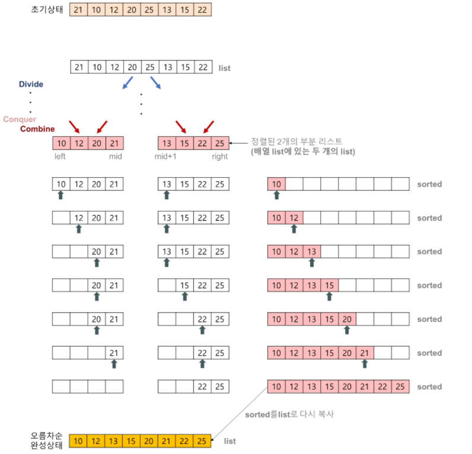
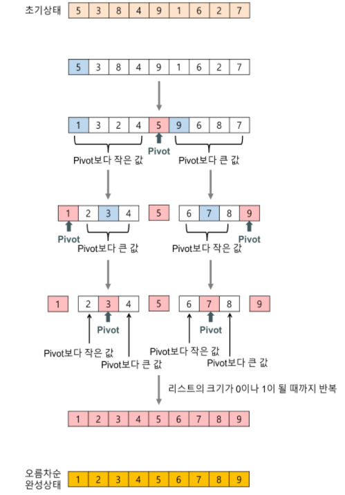
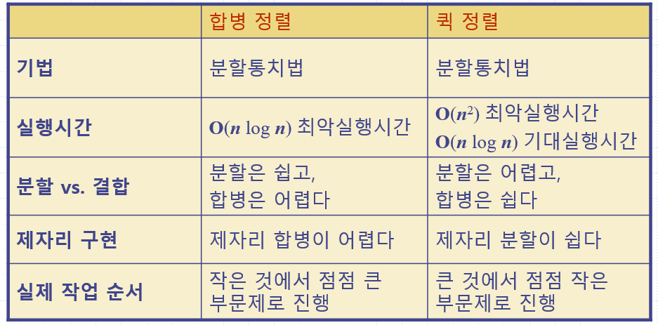
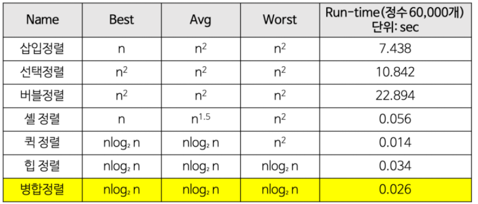

# 🔥C언어 Algorithm

### 🌈연결리스트 구현

>포인터의 경우, 변수에 **저장된 주소 값**과 변수 **자체의 주소 값**을 혼동하지 않도록 하기
>
>
>
>#### 단계 1. 함수 사용 안하는 버전으로 작성하기
>
>>
>>
>>
>
>#### 단계 2. 노드 할당하고 초기화 하는 부분을 함수로 작성하기
>
>>아래의 예시는 정상 작동하지 않는 코드
>>
>>
>>
>> get_node의 인자 node는 get_node의 지역변수 이므로, 이 값이 바뀌는 것은 메인의 변수 head에 
>>
>>아무런 영향을 주지 않는다. 따라서 main의 변수 head의 값은 함수 호출 후에도 여전히 널이고,
>>
>>라인 13에서 head가 가 르키는 구조체를 참조하려고 할 때, 실행 오류가 난다.
>>
>>
>>
>>따라서 main의 변수 head의 값을 동적 할당된 구조체의 주소로 변경해야 한다.
>
>#### 방법A: 함수의 리턴 값을 활용하는 방법
>
>>함수에서 구조체의 주소 값을 리턴하고, main에서는 리턴된 값을 head에 대입
>>
>>
>>
>>main에서 get_node로 전달해야 할 정보가 없기 때문에, 인자는 필요 없다.
>>
>>방법이 제일 쉽지만 main에 리턴해야 할 값이 두 개 이상인 경우에는 사용 할 수 없다.
>
>#### 방법B: 이중 포인터를 활용하는 방법
>
>>변수 head의 주소를 인자로 전달하여 get_node  함수에서 직접 head의 값 변경
>>
>>
>>
>>head의 주소를 get_node함수에 인자로 전달하여, get_node함수에서 간접 참조를 통해
>>
>>변수 head에 저장된 값을 변경한다는 점이다.
>>
>>이 방법은 함수에 의해 변경되어야 할 값이 두개 이상인 경우에 사용 가능하지만, **이중 포인터**를 사용
>
>#### 방법C : head를 구조체로 감싸는 방법
>
>>head의 자체의 주소가 아니라 **head를 감싼 구조체의 주소를 전달**하여 head의 값 변경
>>
>>
>>
>>이 방법은 방법 B와 본질적으로 동일하고 문법적 측면에서 이중 포인터를 피할 수 있다.
>>
>>또 한 List 라는 자료형을 따로 구현하여 의미적으로 명확해 진다.
>>
>
>
>
>연결리스트 구현 파일 안에 Method 방법들 코드 구현하였음.

### 🔄우선순위 큐(선택,버블  & 삽입 정렬)

>Priority Queue의 구현은 크게 두가지로 나뉜다
>
> \- List
>
> >unorderd list (무순리스트)
> >
> >ordered list (순서리스트)
>
> \- Binary Heap
>
>여기서 List의 구현은 또 두가지로 나뉜다
>
> \- Array (배열)
>
> \- Linked List (연결리스트)
>
>그리고 Binary Heap은 Complete Binary Tree(완전이진트리)를 기반으로 한다
>
>완전이진트리는 당연히 Tree의 한 종류이고, Tree의 구현도 두가지인데 리스트의 구현과 동일하다
>
>
>
>이제 우선순위 큐 정렬 방법에 대해 알아보자
>
>버블정렬은 비슷하며 버블 정렬은 옆에 있는 값과 비교하여 더 작은 값을 
>
>반복적으로 앞으로 보내는 정렬 방식이며 가장 쉽지만 비효율적인 정렬이다.
>
>선택정렬은 매 반복마다 가장 큰 값을 찾아, 오른쪽부터 채우는 방식으로 정렬 혹은 왼쪽
>
>으로 채우는 정렬을 말한다.
>
>버블정렬과 선택정렬의 시간복잡도는 포문을 2번 돌기 떄문에  O(n^2) 이다.
>
>#### 버블 ,선택 정렬 코드
>
>>```c
>>#include<stdio.h>
>>int main() {
>>	int i, j, temp, a,*arr;
>>	scanf("%d",&a);
>>	arr = (int*)malloc(sizeof(int)*a);
>>	for (i = 0; i < a; i++) {
>>		scanf("%d",&arr[i]);
>>	}
>>	for (i = 0; i < a; i++) {
>>		for (j = 0; j < a - i; j++) {
>>			if (arr[j] > arr[j + 1]) {
>>				temp = arr[j];
>>				arr[j] = arr[j + 1];
>>				arr[j + 1] = temp;
>>			}
>>		}
>>	}
>>	for (i = 0; i < a; i++) {
>>		printf("%d",arr[i]);
>>	}
>>}
>>```
>>
>>
>
>삽입정렬은 정렬이 필요할시에 정렬하는 방법이다. 
>
>#### 삽입정렬 코드
>
>>```c
>>#include<stdio.h>
>>int main(void) {
>> int *arr,a;
>> scanf("%d",&a);
>> arr=(int*)malloc(sizeof(int)*a);
>> for (int i = 0; i < a; i++) {
>>  scanf("%d ", &data[i]);
>> }
>> for (int i = 0; i<a - 1; ++i) {
>>
>>		int index = i;
>>		while (index >= 0 && ar[index] > ar[index + 1]) {
>>			swap(&ar[index], &ar[index + 1]);
>>			index--;
>>		}
>>	}
>> for (int i = 0; i < a; i++) {
>>  printf("%d ", data[i]);
>> }
>> printf("\n");
>> return 0;
>>}
>>```
>>
>>
>
>따라서 삽입정렬은 비교적 정렬되어 있는 숫자들을 정령할 때 어떠한 정렬 알고리즘보다 더 빠른 속도를 보여준다.
>
>하지만 정렬되어 있지 않는 숫자나 역으로 정렬되어있는 숫자를 정렬하면 버블정렬,선택 정렬보다 더 느린 모습을 보여준다.
>
>우선순위큐에 임의의숫자 정렬, 정렬되어있는 숫자 정렬, 역으로 정렬되어있는 것을 정렬 순으로 걸린 시간을 비교한 것이 있으며
>
>정렬되어 있는 경우에 빠른 것을 확인 할 수 있다.
>
>
>
>#### 결론
>
>> 각 n에 대해서 n이 커짐에 따라 O(n^2)을 따라가는 것을 알 수 있으며 특이 케이스로 정렬되어있을 경우 
>>
>> 삽입정렬은 O(N^2)을 따르지 않으며 어떤 알고리즘보다 빠르다.
>>
>> 
>>

### 🔀힙과 힙정렬

> #### 힙과 힙정렬 정의
>
> >힙 정렬은 병합정렬(Merge Sort)와 퀵 정렬(Quick Sort)만큼 빠른 정렬 알고리즘이다.
> >
> >**힙은 최솟값이나 최댓값을 빠르게 찾아내기 위해 완전 이진트리를 기반으로 하는 트리이다.**
> >
> >여기서 이진트리는 배열을 이용한 **순차트리** 형태로, 또는 연결리스트를 이용한 **연결트리** 형태로 구현할 
> >
> >수 있다.  순차트리로 구현된 힙을 **순차힙**, 연결트리로 구현된 힙을 **연결힙**이라고 부른다.
> >
> >최대 힙은 부모노드가 자식노드보다 큰 힙, 최소 힙은 부모노드가 자식노드보다 작은 힙을 말한다.
> >
> >힙 정렬을 수행하기 위해서는 힙 생성 알고리즘(Heapify Algorithm)을 사용한다.
> >
> >**힙 생성**은 **삽입식**(insertion)과 **상향식**(bottom-up)의 두 가지 방식이 있다. **삽입식**은 모든 키들이 미리 주
> >
> >어진 경우, 또는 키들이 차례로 주어지는 경우, 양쪽에 적용 가능하지만 **상향식**은 전자인 경우에만 적용 
> >
> >가능하다. 
> >
> >이 알고리즘은 '하나의 노드'에 대해 수행하는 것이다. 전제조건은 '하나의 노드를 제외하고는 최대 힙이 
> >
> >구성되어 있는 상태'라는 가정을 지닌다.
>
> #### 힙정렬 코드
>
> >삽입식에서의 항목을 넣으려면 들어온 item에 대해 정렬이 필요하다.
> >
> >힙 알고리즘에서의 upHeap 코드이다.
> >
> >```c
> >void upHeap(int i) {
> >	while (i > 1 && H[i] > H[i / 2]) {
> >		swap(&H[i], &H[i / 2]);
> >		i /= 2;
> >	}
> >}
> >```
> >
> >최대값을 지우고 재 정렬하고 나서 최대값을 반환하는 코드이다.
> >
> >```c
> >void downHeap(int i) {
> >	int index = i, child;
> >	while (index <= N / 2) {
> >		child = index * 2;
> >		if (child + 1 <= N && H[child] < H[child + 1]) {
> >			child++;
> >		}
> >		if (H[child] > H[index]) {
> >			swap(&H[child], &H[index]);
> >			index =child;
> >		}
> >		else {
> >			break;
> >		}
> >
> >	}
> >}
> >int removeMax() {
> >	int max = H[1];
> >	H[1] = H[N];
> >	N--;
> >	downHeap(1);
> >	return max;
> >}
> >```
> >
> >상향식 힙 생성을 위한 재귀 또는 비재귀 방식의 알고리즘 코드이다.
> >
> >```c
> >void rBuildHeap(int index) { //재귀
> >	if (index > N)
> >		return;
> >	rBuildHeap(2 * index);
> >	rBuildHeap(2 * index + 1);
> >	downHeap(index);
> >	
> >}
> >void buildHeap() {	//비재귀
> >
> >	for (int i = N / 2; i >= 1; i--)
> >		downHeap(i);
> >}
> >```
> >
> >
>
> #### 힙정렬 시간복잡도 및 특징
>
> >힙 생성 알고리즘의 시간복잡도는 한 번 자식 노드로 내려 갈 때마다 노드의 갯수가 2배씩 증가한다는 면에
> >
> >서O(log N)이다. (높이 차원) 이 때 데이터 데이터의 갯수가 N개 이므로 전체 트리를 힙 구조로 만드는 복잡
> >
> >도는**O(N*logN)**이다. 실제로는 특정한 숫자N에서 1/2만큼 힙 생성 알고리즘을 해도 힙 구조를 만들 수 있
> >
> >기 때문에 1/2*N *logN 인데 1/2 *N이 logN보다 증가율이 크기 때문에 **O(N)**으로 나타 낼 수 있다. 힙 정렬
> >
> >은 병합정렬과 다르게 별도로 추가적인 배열이 필요하지 않다는 점에서 메모리적으로 효율적이다.
> >
> >하지만 단순한 속도만 가지고 비교하면 퀵 정렬이 평균적으로 더 빠르기 때문에 힙 정렬이 일반적으로많이 
> >
> >사용되지는 않는다.
>

### 🔁합병정렬

>일반적인 방법으로 구현했을 때 이 정렬은 **안정 정렬** 에 속하며, **분할 정복 알고리즘**의 하나 이다.
>
>분할 정복(divide and conquer) 방법
>
>>문제를 작은 2개의 문제로 분리하고 각각을 해결한 다음, 결과를 모아서 원래의 문제를 해결하는 전략이다.
>>
>>분할 정복 방법은 대개 순환 호출을 이용하여 구현한다.
>
>과정 설명
>
>>리스트의 길이가 0 또는 1이면 이미 정렬된 것으로 본다. 그렇지 않은 경우에는
>>
>>정렬되지 않은 리스트를 절반으로 잘라 비슷한 크기의 두 부분 리스트로 나눈다.
>>
>>각 부분 리스트를 재귀적으로 합병 정렬을 이용해 정렬한다.
>>
>>두 부분 리스트를 다시 하나의 정렬된 리스트로 합병한다.
>
>합병 정렬은 다음의 단계들로 이루어진다.
>
>>**분할(Divide)**: 입력 배열을 같은 크기의 2개의 부분 배열로 분할한다.
>>
>>**정복(Conquer):** 부분 배열을 정렬한다. 부분 배열의 크기가 충분히 작지 않으면 순환 호출 을 이용하여 다시 분할 정복 방법을 적용한다.
>>
>>**결합(Combine):** 정렬된 부분 배열들을 하나의 배열에 합병한다.
>
>
>
>
>
>### 합병 정렬(merge sort) 알고리즘의 특징
>
>#### 단점
>
>>만약 레코드를 배열(Array)로 구성하면, 임시 배열이 필요하다.
>>
>>제자리 정렬(in-place sorting)이 아니다.
>>
>>레크드들의 크기가 큰 경우에는 이동 횟수가 많으므로 매우 큰 시간적 낭비를 초래한다.
>
>#### 장점
>
>> 안정적인 정렬 방법
>>
>> 데이터의 분포에 영향을 덜 받는다. 즉, 입력 데이터가 무엇이든 간에 정렬되는 시간은 동일하다. (O(nlog₂n)로 동일)
>>
>> 만약 레코드를 연결 리스트(Linked List)로 구성하면, 링크 인덱스만 변경되므로 데이터의 이동은 무시할 수 있을 정도로 작아진다.
>>
>> > 제자리 정렬(in-place sorting)로 구현할 수 있다.
>>
>> 따라서 크기가 큰 레코드를 정렬할 경우에 연결 리스트를 사용한다면, 합병 정렬은 퀵 정렬을 포함한 다른 어떤 졍렬 방법보다 효율적이다.
>
>#### 합병 정렬 시간 복잡도
>
>>순환 호출의 깊이는 높이: k=log2N
>>
>>합병 단계의 비교연산은 최대 n번의 비교연산을 수행함
>>
>>따라서 순솬 호출의 깊이 만큼의 합병단계* 각 합병 단계의 비교연산 =nlog2N
>
>#### 핵심코드
>
>``` c
>Node* merge(Node* L1, Node* L2) {
>
>	Node* mergedList = NULL;
>
>	if (L1 == NULL)
>		return L2;
>	if (L2 == NULL)
>		return L1;
>
>	if (L1->data < L2->data) {
>		mergedList = L1;
>		mergedList->next = merge(L1->next, L2);
>	}
>	else {
>		mergedList = L2;
>		mergedList->next = merge(L1, L2->next);
>	}
>
>	return mergedList;
>}
>
>Lists mg_partition(Node* L, int k) {
>
>	Node* L1;
>	Node* L2;
>
>	Node* horse = L;
>	Node* before = L;
>
>	int index = 0;
>	while (index < k / 2) {
>		before = horse;
>		horse = horse->next;
>		index++;
>	}
>
>	L1 = L;
>	L2 = horse;
>	before->next = NULL;
>
>	Lists lists = { L1, L2 };
>	return lists;
>}
>
>void mergeSort(Node** L) {
>
>	int k = findLength(*L);
>	if (k < 2)
>		return;
>
>	Lists lists = mg_partition(*L, k);
>	mergeSort(&lists.L1);
>	mergeSort(&lists.L2);
>	*L = merge(lists.L1, lists.L2);
>}
>```
>
>나머지 코드는 합병정렬 폴더 안에 기재.

### 🔂퀵 정렬

>퀵 정렬은 불안정 정렬에 속하며,  다른 원소와의 비교만으로 정렬을 수행하는 비교 정렬에 속한다.
>
>분할 정복 알고리즘의 하나로, 평균적으로 매우 빠른 수행속도를 자랑하는 정렬 방법이며
>
>합병 정렬(merge sort)과 달리 퀵 정렬은 리스트를 비균등하게 분할한다.
>
>분할 정복(divide and conquer) 방법
>
>>문제를 작은 2개의 문제로 분리하고 각각을 해결한 다음, 결과를 모아서 원래의 문제를 해결하는 전략이다.
>>
>>분할 정복 방법은 대개 순환 호출을 이용하여 구현한다.
>
>과정 설명
>
>>리스트 안에 있는 한 요소를 선택한다. 이렇게 고른 원소를 피벗(pivot) 이라고 한다.
>>
>>피벗을 기준으로 피벗보다 작은 요소들은 모두 피벗의 왼쪽으로 옮겨지고 피벗보다 큰 요소들은 모두 피벗의 오른쪽으로 옮겨진다. (피벗을 중심으로 왼쪽: 피벗보다 작은 요소들, 오른쪽: 피벗보다 큰 요소들)
>>
>>피벗을 제외한 왼쪽 리스트와 오른쪽 리스트를 다시 정렬한다.
>>
>>>부분 리스트에서도 다시 피벗을 정하고 피벗을 기준으로 2개의 부분 리스트로 나누는 과정을 반복한다.
>>>
>>>분할된 부분 리스트에 대하여 순환 호출 을 이용하여 정렬을 반복한다.
>>
>>리스트의 크기가 0이나 1이 될 때까지 반복한다.
>
>
>
>### 퀵 정렬(quick sort) 알고리즘의 특징
>
>>#### 장점
>>
>>속도가 빠르다.
>>
>>시간 복잡도가 O(nlog₂n)를 가지는 다른 정렬 알고리즘과 비교했을 때도 가장 빠르다.
>>
>>추가 메모리 공간을 필요로 하지 않는다.
>>
>>퀵 정렬은 O(log n)만큼의 메모리를 필요로 한다.
>>
>>
>>
>>#### 단점
>>
>>정렬된 리스트에 대해서는 퀵 정렬의 불균형 분할에 의해 오히려 수행시간이 더 많이 걸린다.
>>
>>퀵 정렬의 불균형 분할을 방지하기 위하여 피벗을 선택할 때 더욱 리스트를 균등하게 분할할 수 있는 데이터를 선택한다.
>>
>>EX) 리스트 내의 몇 개의 데이터 중에서 크기순으로 중간 값(medium)을 피벗으로 선택한다.
>
>#### 퀵 정렬 의 시간복잡도
>
>>순환 호출의 깊이는 log2N
>>
>>순환호출 단계의 비교 연산 : 각 순환 호출에서는 전체 리스트의 대부분의 레코드를 비교
>>
>>평균 n번 정도의 비교가 이루어진다.
>>
>>순환 호출의 깊이* 각 순환 호출 단계의 비교 연산 = nlog2N
>>
>>다만 최악의 경우 리스트가 계속 불균형하게 나누어 지는 경우 
>>
>>순환 호출의 깊이는 N
>>
>>순환 호출 단계의 비교 연산은 평균 N번
>>
>>따라서 순환 호출의 깊이* 각 순환 호출 단계의 비교 연산 = N^2
>
>#### 핵심코드
>
>>```c
>>Partition inPlacePartition(int *L, int l, int r, int pivotIndex) {
>>	
>>	if(l >= r)
>>		return;
>>	
>>	int pivot = L[pivotIndex];
>>	
>>	//pivot 맨 오른쪽으로 
>>	swap(&L[pivotIndex], &L[r]);
>>	
>>	int toRight = l;
>>	int toLeft = r-1;
>>
>>	while(toRight <= toLeft) {
>>		
>>		//피벗보다 크거나 같은 값을 찾아서 
>>		while(L[toRight] <= pivot && toRight < r)
>>			toRight++;
>>		//피벗보다 작거나 같은 값을 찾아서	
>>		while(L[toLeft] >= pivot && toLeft >= l)
>>			toLeft--;
>>		
>>		//엇갈리지 않은 경우 값만 변경
>>		if(toRight <= toLeft)
>>			swap(&L[toRight++], &L[toLeft--]);
>>	}
>>	
>>	//엇갈린 경우 피벗과 swap
>>	swap(&L[r], &L[toRight]);
>>	
>>	// 3 way partitioning
>>	// a,b 시작은 pivot의 자리로 부터 
>>	// pivot과 같은 값을 찾으면 a는 좌로 b는 우로 한칸씩 늘려가며 swap
>>	int a = toRight;
>>	int b = toRight;
>>
>>	// 왼쪽 구간 확인
>>	// left 변수를 한칸씩 이동하며 pivot과 같은 값이면 가운데 구간으로 swap
>>	int left = l;
>>	while(left < a) {
>>		if(L[left] == pivot)
>>			swap(&L[left], &L[--a]);
>>		else
>>			left++;
>>	}
>>
>>	// 오른쪽 구간 확인
>>	// right 변수를 한칸씩 이동하며 pivot과 같은 값이면 가운데 구간으로 swap
>>	int right = r;
>>	while(right > b) {
>>		if(L[right] == pivot)
>>			swap(&L[right], &L[++b]);
>>		else
>>			right--;
>>	}
>>
>>	Partition partition = {a,b};
>>	return partition;	
>>}
>>
>>void inPlaceQuickSort(int *L, int l, int r) {
>>	
>>	if(l >= r)
>>		return;
>>	
>>	int pivotIndex = find_pivot_index(L, l, r);
>>	
>>	Partition partition = inPlacePartition(L,l,r,pivotIndex);
>>	
>>	inPlaceQuickSort(L, l, partition.L-1);
>>	inPlaceQuickSort(L, partition.R+1, r);
>>}
>>
>>```
>>
>>나머지는 퀵정렬에 기재 해둠.
>
>#### 합병 정렬과 퀵정렬 비교
>
>
>
>

#### 인터넷 보며 배운 용어들

>ADT= 추상형 자료 구조형의 약자 (Abstract Data Type)
>PQ=우선순위 큐(Priority Queue)
>
>완전이진트리: 데이터라 루트노드부터 시작해서 자식노드가 왼쪽자식 노드,오른쪽 자식 노드로 차근차근 들어가는 구조의 이진트리
>
>알고리즘의 실행시간을 두 부분으로 나누면
>
>1. 입력값의 크기에 따라 알고리즘의 실행시간을 검증해볼 수 있다.
>2. 입력값의 크기에 따른 함수의 증가량, 우리는 이것을 성장률이라고 부른다.
>    이때 중요하지 않는 상수와 계수들을 제거하면 알고리즘의 실행시간에서 중요한
>    성장률에 집중할 수있는데 이것을 점금적 표기법(Asymptotic notation)이라 부른다.
>    여기서, 점근적이라는 의미는 가장 큰 영향을 주는 항만 계산한다는 의미다.
>
>점근적 표기법은 다음 세가지가 있는데 시간복잡도를 나타내는데 사용된다.
>
>- 최상의 경우 : 오메가 표기법 (Big-Ω Notation)
>- 평균의 경우 : 세타 표기법 (Big-θ Notation)
>- 최악의 경우 : 빅오 표기법 (Big-O Notation)
>
>평균인 세타 표기를 하면 가장 정확하고 좋겠지만 평가하기가 까다롭다.
>그래서 최악의 경우인 빅오를 사용하는데 알고리즘이 최악일때의 경우를 판단하면 평균과 가까운 성능으로 예측하기 쉽기때문이다.
>
>## 빅오 표기법(Big-O)
>
>빅오 표기법은 불필요한 연산을 제거하여 알고리즘분석을 쉽게 할 목적으로 사용된다.
>
>Big-O로 측정되는 복잡성에는 시간과 공간복잡도가 있는데
>
>- 시간복잡도는 입력된 N의 크기에 따라 실행되는 조작의 수를 나타낸다.
>
>- 공간복잡도는 알고리즘이 실행될때 사용하는 메모리의 양을 나타낸다.
> 요즘에는 데이터를 저장할 수 있는 메모리의 발전으로 중요도가 낮아졌다.
>
>- 아래는 대표적인 Big-O의 복잡도를 나타내는 표이다.
>
>- 
>
> ## 시간복잡도
>
> 시간복잡도의 가장 간단한 정의는 알고리즘의 성능을 설명하는 것.
> 다른의미로는 알고리즘을 수행하기 위해 프로세스가 수행해야하는 연산을 수치화 한것이다.
> 왜 실행시간이 아닌 연산수치로 판별할까? 위에도 설명했지만 명령어의 실행시간은 컴퓨터의 하드웨어 또는 프로그래밍 언어에 따라 편차가 크게 달라지기 때문에 명령어의 실행 횟수만을 고려하는 것이다.
>
> 시간복잡도에서 중요하게 보는것은 가장큰 영향을 미치는 n의 단위이다.
>
> ```
> 1             O(1)   --> 상수
> 2n + 20       O(n)   --> n이 가장 큰영향을 미친다.
> 3n^2          O(n^2) --> n^2이 가장 큰영향을 미친다.
> ```
>
> 시간복잡도의 문제해결 단계를 나열 하면 아래와같다.
>
> ```
> O(1) – 상수 시간 : 문제를 해결하는데 오직 한 단계만 처리함.
> O(log n) – 로그 시간 : 문제를 해결하는데 필요한 단계들이 연산마다 특정 요인에 의해 줄어듬.
> O(n) – 직선적 시간 : 문제를 해결하기 위한 단계의 수와 입력값 n이 1:1 관계를 가짐.
> O(n log n) : 문제를 해결하기 위한 단계의 수가 N*(log2N) 번만큼의 수행시간을 가진다. (선형로그형)
> O(n^2) – 2차 시간 : 문제를 해결하기 위한 단계의 수는 입력값 n의 제곱.
> O(C^n) – 지수 시간 : 문제를 해결하기 위한 단계의 수는 주어진 상수값 C 의 n 제곱.
> ```
>
> 아래표는 실행시간이 빠른순으로 입력 N값에 따른 서로 다른 알고리즘의 시간복잡도이다.
>
>| Complexity | 1    | 10      | 100                             |
>| :--------- | :--- | :------ | :------------------------------ |
>| O(1)       | 1    | 1       | 1                               |
>| O(log N)   | 0    | 2       | 5                               |
>| O(N)       | 1    | 10      | 100                             |
>| O(N log N) | 0    | 20      | 461                             |
>| O(N^2)     | 1    | 100     | 10000                           |
>| O(2^N)     | 1    | 1024    | 1267650600228229401496703205376 |
>| O(N!)      | 1    | 3628800 | 화면에 표현할 수 없음!          |
>
> ### O(1) : 상수
>
> 아래 예제 처럼 입력에 관계없이 복잡도는 동일하게 유지된다.
>
> ```
> def hello_world():
>         print("hello, world!")
> ```
>
> ### O(N) : 선형
>
> 입력이 증가하면 처리 시간또는 메모리 사용이 선형적으로 증가한다.
>
> ```
> def print_each(li):
>     for item in li:
>         print(item)
> ```
>
> ### O(N^2) : Square
>
> 반복문이 두번 있는 케이스
>
> ```
> def print_each_n_times(li):
>     for n in li:
>         for m in li:
>             print(n,m)
> ```
>
> ### O(log n) O(n log n)
>
> 주로 입력 크기에 따라 처리 시간이 증가하는 정렬알고리즘에서 많이 사용된다.
> 다음은 이진검색의 예이다.
>
> ```
> def binary_search(li, item, first=0, last=None):
> 	if not last:
> 		last = len(li)
> 
> 	midpoint = (last - first) / 2 + first
> 
> 	if li[midpoint] == item:
> 		return midpoint
> 
> 	elif li[midpoint] > item:
> 		return binary_search(li, item, first, midpoint)
> 
> 	else:
> 		return binary_search(li, item, midpoint, last)
> ```
>
> ## 시간복잡도를 구하는 요령
>
> 각 문제의 시간복잡도 유형을 빨리 파악할 수 있도록 아래 예를 통해 빠르게 알아 볼수 있다.
>
> - 하나의 루프를 사용하여 단일 요소 집합을 반복 하는 경우 : O (n)
> - 컬렉션의 절반 이상 을 반복 하는 경우 : O (n / 2) -> O (n)
> - 두 개의 다른 루프를 사용하여 두 개의 개별 콜렉션을 반복 할 경우 : O (n + m) -> O (n)
> - 두 개의 중첩 루프를 사용하여 단일 컬렉션을 반복하는 경우 : O (n²)
> - 두 개의 중첩 루프를 사용하여 두 개의 다른 콜렉션을 반복 할 경우 : O (n * m) -> O (n²)
> - 컬렉션 정렬을 사용하는 경우 : O(n*log(n))
>
> 
>
> ## 정렬 알고리즘 비교
>
>
>
>| Sorting Algorithms | 공간 복잡도 | 시간 복잡도 |             |             |
>| :----------------- | :---------- | :---------- | :---------- | ----------- |
>|                    | 최악        | 최선        | 평균        | 최악        |
>| Bubble Sort        | O(1)        | O(n)        | O(n2)       | O(n2)       |
>| Heapsort           | O(1)        | O(n log n)  | O(n log n)  | O(n log n)  |
>| Insertion Sort     | O(1)        | O(n)        | O(n2)       | O(n2)       |
>| Mergesort          | O(n)        | O(n log n)  | O(n log n)  | O(n log n)  |
>| Quicksort          | O(log n)    | O(n log n)  | O(n log n)  | O(n2)       |
>| Selection Sort     | O(1)        | O(n2)       | O(n2)       | O(n2)       |
>| Shell Sort         | O(1)        | O(n)        | O(n log n2) | O(n log n2) |
>| Smooth Sort        | O(1)        | O(n)        | O(n log n)  | O(n log n)  |
>
>------
>
> ## 자료구조 비교
>
>| Data Structures    | Average Case | Worst Case |          |          |          |          |
>| :----------------- | :----------- | :--------- | :------- | :------- | :------- | -------- |
>|                    | Search       | Insert     | Delete   | Search   | Insert   | Delete   |
>| Array              | O(n)         | N/A        | N/A      | O(n)     | N/A      | N/A      |
>| Sorted Array       | O(log n)     | O(n)       | O(n)     | O(log n) | O(n)     | O(n)     |
>| Linked List        | O(n)         | O(1)       | O(1)     | O(n)     | O(1)     | O(1)     |
>| Doubly Linked List | O(n)         | O(1)       | O(1)     | O(n)     | O(1)     | O(1)     |
>| Stack              | O(n)         | O(1)       | O(1)     | O(n)     | O(1)     | O(1)     |
>| Hash table         | O(1)         | O(1)       | O(1)     | O(n)     | O(n)     | O(n)     |
>| Binary Search Tree | O(log n)     | O(log n)   | O(log n) | O(n)     | O(n)     | O(n)     |
>| B-Tree             | O(log n)     | O(log n)   | O(log n) | O(log n) | O(log n) | O(log n) |
>| Red-Black tree     | O(log n)     | O(log n)   | O(log n) | O(log n) | O(log n) | O(log n) |
>| AVL Tree           | O(log n)     | O(log n)   | O(log n) | O(log n) | O(log n) | O(log n) |
>
> 출저:[BIg O](https://blog.chulgil.me/algorithm/#:~:text=공간복잡도는 알고리즘이,발전으로 중요도가 낮아졌다.)
>
> 
>
> 
>
> 


