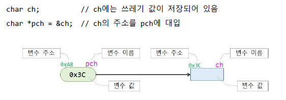
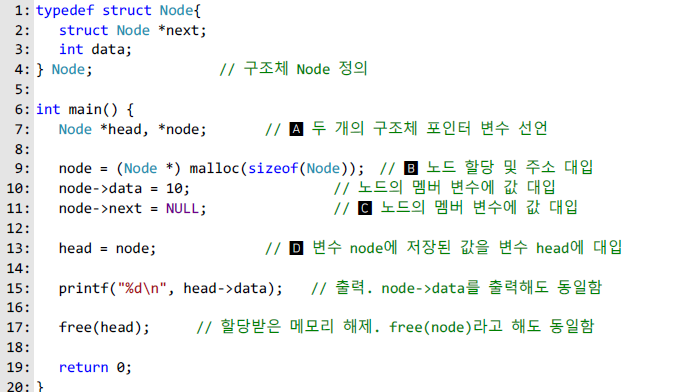
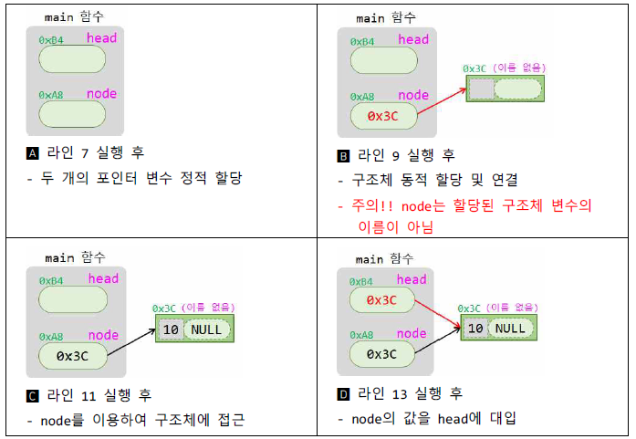
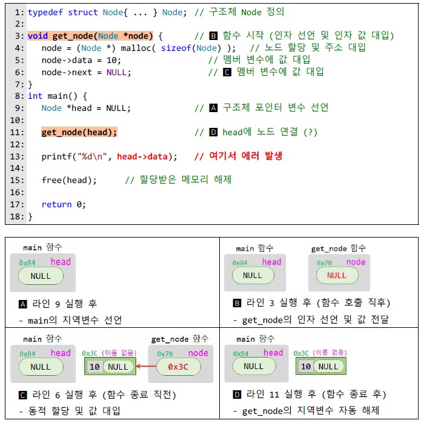
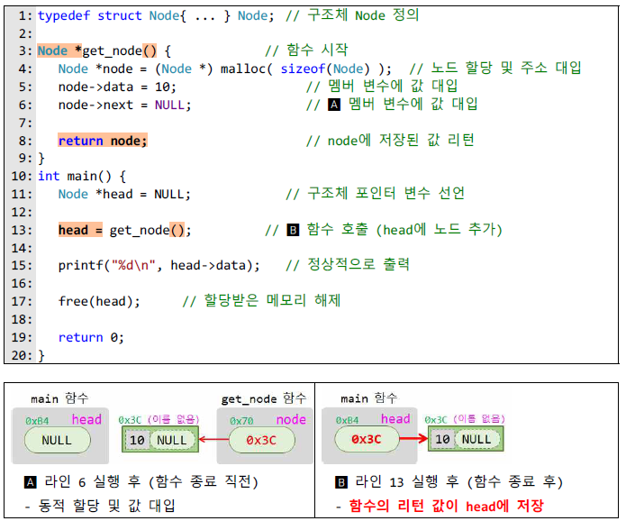
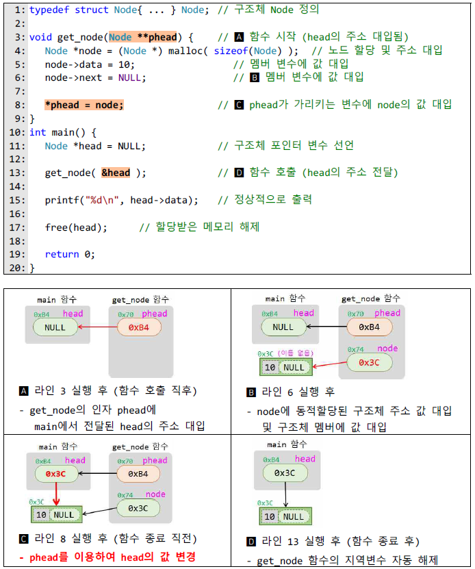
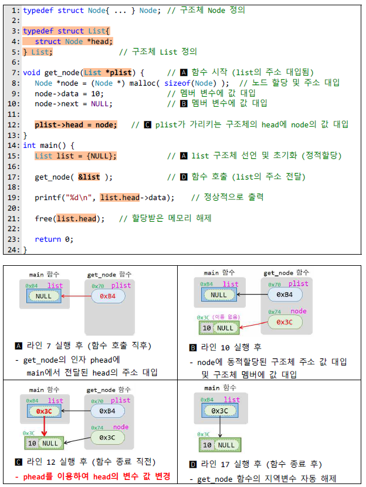
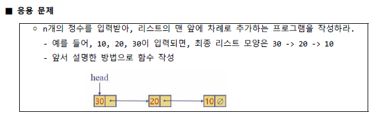

# 🔥C언어 Algorithm

### 🌈연결리스트 구현

>포인터의 경우, 변수에 **저장된 주소 값**과 변수 **자체의 주소 값**을 혼동하지 않도록 하기
>
>
>
>#### 단계 1. 함수 사용 안하는 버전으로 작성하기
>
>>
>>
>>
>
>#### 단계 2. 노드 할당하고 초기화 하는 부분을 함수로 작성하기
>
>>아래의 예시는 정상 작동하지 않는 코드
>>
>>
>>
>> get_node의 인자 node는 get_node의 지역변수 이므로, 이 값이 바뀌는 것은 메인의 변수 head에 
>>
>>아무런 영향을 주지 않는다. 따라서 main의 변수 head의 값은 함수 호출 후에도 여전히 널이고,
>>
>>라인 13에서 head가 가 르키는 구조체를 참조하려고 할 때, 실행 오류가 난다.
>>
>>
>>
>>따라서 main의 변수 head의 값을 동적 할당된 구조체의 주소로 변경해야 한다.
>
>#### 방법A: 함수의 리턴 값을 활용하는 방법
>
>>함수에서 구조체의 주소 값을 리턴하고, main에서는 리턴된 값을 head에 대입
>>
>>
>>
>>main에서 get_node로 전달해야 할 정보가 없기 때문에, 인자는 필요 없다.
>>
>>방법이 제일 쉽지만 main에 리턴해야 할 값이 두 개 이상인 경우에는 사용 할 수 없다.
>
>#### 방법B: 이중 포인터를 활용하는 방법
>
>>변수 head의 주소를 인자로 전달하여 get_node  함수에서 직접 head의 값 변경
>>
>>
>>
>>head의 주소를 get_node함수에 인자로 전달하여, get_node함수에서 간접 참조를 통해
>>
>>변수 head에 저장된 값을 변경한다는 점이다.
>>
>>이 방법은 함수에 의해 변경되어야 할 값이 두개 이상인 경우에 사용 가능하지만, **이중 포인터**를 사용
>
>#### 방법C : head를 구조체로 감싸는 방법
>
>>head의 자체의 주소가 아니라 **head를 감싼 구조체의 주소를 전달**하여 head의 값 변경
>>
>>
>>
>>이 방법은 방법 B와 본질적으로 동일하고 문법적 측면에서 이중 포인터를 피할 수 있다.
>>
>>또 한 List 라는 자료형을 따로 구현하여 의미적으로 명확해 진다.
>>
>
>
>
>연결리스트 구현 파일 안에 Method 방법들 코드 구현