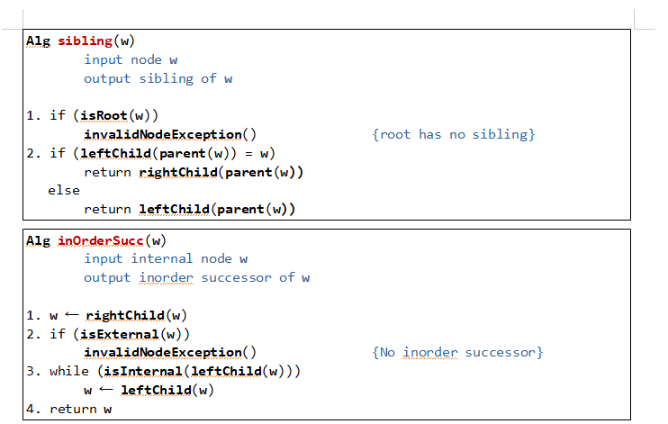

### 알고리즘 의사코드 짜보기

#### 제자리 선택,삽입 정렬

>```c
>Alg inPlaceSelectionSort(A)
>
>for pass<- 0 to n-2
>	minLoc<-pass
>	for j <- (pass+1) to n-1
>		if(A[j]<A[minLoc])
>			minLoc<-j
>	A[pass]<-A[minLoc]
>```
>
>```c
>Alg inPlaceInsertionSort(A)
>
>for pass <- 1 to n-1
>	save <-A[pass]
>	j <-pass-1
>	while(j>=0 & A[j]>save)
>		A[j+1]=A[j];
>		j<-j-1
>	A[j+1]<-save
>```
>
>오름차순 정렬

#### 힙과 힙정렬

>
>
>삽입노드를 찾기 위한 마지막 노드갱신
>
>```c
>Alg advanceLast(z)
>while(z->parent->right=z){
>	z<-z.parent	
>}
>if(z->parent->left=z){
>	z<-sibling(z)
>}
>while(z.left!=NULL & z.right!=NULL){
>	z<-z.left
>}
>
>
>```
>
>삭제노드를 찾기 위한 마지막 노드갱신
>
>```c
>Alg retreatLast(z)
>while(z.left!=NULL & z.right!=NULL){
>	z<-z.left
>}    
>while(z->parent->left=z){
>	z<-sibling(z)
>}
>while(z->parent->right=z){
>	z<-z.parent	
>}
>
>```
>
>
>

### 합병정렬,퀵정렬

>합병정렬에서 분할 과정은 O(logN) 이고,merge과정(합병)은 O(n) 이고 합병정렬은 높이를 곱하기 때문에 O(nlogn) 시간만큼 걸린다.
>
>퀵정렬에서 분할과정은 O(n)이고 퀵정렬의 기대실행시간 O(nlogn) 만큼 걸린다. 
>
>분할정복을 통한 최대 최소 3n/2 안으로 구하기
>
>```c
>#include<stdio.h>
>int a[12] = { 3,6,1,5,100,3,3,5,9,5,1000,-5 };
>typedef struct EQ{
>	int a,b;
>}EQ;
>EQ findMax(int low, int high) {
>	EQ eq;
>	if (low == high) {
>		eq.a = a[low];
>		eq.b = a[low];
>		return eq;
>	}
>	else
>	{
>		EQ leftMax = findMax(low, (high + low) / 2);
>		EQ rightMax  = findMax((high + low) / 2+1,high );
>		eq.a= leftMax.a > rightMax.a ? leftMax.a : rightMax.a;
>		eq.b = leftMax.b < rightMax.b ? leftMax.b : rightMax.b;
>	}
>	return eq;
>}
>int main() {
>	EQ eq = findMax(0, 11);
>	printf("%d %d",eq.a,eq.b );
>}
>```
>
>

### 퀵정렬

>```c
>// 퀵 선택
>int partition(int arr[],int l,int r) {
>
>	int i = l, j = r-1;
>	int temp;
>	int pivot = (l + r) / 2;
>	temp = arr[pivot];
>	arr[pivot] = arr[r];
>	arr[r] = temp;
>	while (i <= j) {
>
>		while(i <= j && arr[i] < arr[r])
>			i++;
>		while(i <= j && arr[j] > arr[r])
>			j--;
>		if (i < j) {
>			temp = arr[i];
>			arr[i] = arr[j];
>			arr[j] = temp;
>			i++; 
>			j--;
>		}
>	}
>
>	temp = arr[i];
>	arr[i] = arr[r];
>	arr[r] = temp;
>
>	return i;
>
>}
>int quickSelect(int arr[],int l,int r,int k) {
>	if (l >= r)
>		return ;
>
>	int pivot = partition(arr, l, r);
>	if (pivot == k)
>		return arr[pivot];
>	else if (pivot > k)
>		quickSelect(arr, l, pivot - 1, k);
>	else if (pivot < k)
>		quickSelect(arr, pivot +1, r, k);
>}
>```
>
>### 삼분할 partition 버전 1
>
>```c
>Alg inPlacePartition(A, l, r, k)
>
>Input array A, integer l, r, k
>Output integer a,b
>a <- l
>i <- l
>b <- r
>pivot = A[k]
>1. while(i<=b)
>	if(A[i] < pivot)
>		A[a] <->A[i]
>		a<-a+1
>		i<i+1
>	else if(A[i]>pivot)
>		A[i]<->A[b]
>		b<-b-1
>	else
>		i<-i+1
>2. return a,b
>```
>
>### 버전 2
>
>```c
>if (l >= r)
>		return;
>
>	int pivot = L[pivotIndex];
>
>	//pivot 맨 오른쪽으로 
>	swap(&L[pivotIndex], &L[r]);
>
>	int toRight = l;
>	int toLeft = r - 1;
>
>	while (toRight <= toLeft) {
>
>		//피벗보다 크거나 같은 값을 찾아서 
>		while (L[toRight] <= pivot && toRight <= r)
>			toRight++;
>		//피벗보다 작거나 같은 값을 찾아서	
>		while (L[toLeft] >= pivot && toLeft >= l)
>			toLeft--;
>
>		//엇갈리지 않은 경우 값만 변경
>		if (toRight < toLeft)
>			swap(&L[toRight++], &L[toLeft--]);
>		while (L[toRight] <= pivot && toRight <= toLeft)
>			toRight++;
>		while (L[toLeft] >= pivot && toLeft >= toRight)
>			toLeft--;
>		if (toRight < toLeft)
>			swap(&L[toRight], &L[toLeft]); //이 부분이 다르다. 
>	}
>
>	//엇갈린 경우 피벗과 swap
>	swap(&L[r], &L[toRight]);
>
>	// 3 way partitioning
>	// a,b 시작은 pivot의 자리로 부터 
>	// pivot과 같은 값을 찾으면 a는 좌로 b는 우로 한칸씩 늘려가며 swap
>	int a = toRight;
>	int b = toRight;
>
>	// 왼쪽 구간 확인
>	// left 변수를 한칸씩 이동하며 pivot과 같은 값이면 가운데 구간으로 swap
>	int left = l;
>	while (left < a) {
>		if (L[left] == pivot)
>			swap(&L[left], &L[--a]);
>		else
>			left++;
>	}
>
>	// 오른쪽 구간 확인
>	// right 변수를 한칸씩 이동하며 pivot과 같은 값이면 가운데 구간으로 swap
>	int right = r;
>	while (right > b) {
>		if (L[right] == pivot)
>			swap(&L[right], &L[++b]);
>		else
>			right--;
>	}
>
>	Partition partition = { a,b };
>	return partition;
>```
>
>### 비재귀로 퀵정렬 구현하기
>
>```c
>#include<stdio.h>
>#include<stdlib.h>
>int arr[100];
>int top;
>int stack[100];
>int pop() {
>	if (top == 0)
>		return 0;
>	else
>		return stack[--top];
>}
>void push(int data) {
>	stack[top++] = data;
>}
>int isStackEmpty() {
>	if (top == 0)
>		return 1;
>	else
>		return 0;
>}
>void quicksort(int arr[], int l,int r) {
>	int q, toright, toleft,temp;
>	push(r); 
>	push(l); //l를 먼저 꺼내니 마지막에 넣기 
>	while (!isStackEmpty()) {
>		l = pop();
>		r = pop();
>		q = (l + r) / 2;
>		toright = l;
>		toleft = r - 1;
>		temp = arr[q];
>		arr[q] = arr[r];
>		arr[r] = temp;
>		if (l < r) {
>
>			while (toright <= toleft) {
>				while (toright <= toleft && arr[toright] <= arr[r])
>					toright++;
>				while (toright <= toleft && arr[toleft] >= arr[r])
>					toleft--;
>				if (toright < toleft) {
>					temp = arr[toright];
>					arr[toright] = arr[toleft];
>					arr[toleft] = temp;
>				}
>			}
>
>			temp = arr[toright];
>			arr[toright] = arr[r];
>			arr[r] = temp;
>			push(r);			// 오른쪽 분할의 오른쪽 끝
>			push(toright + 1);	// 오른쪽 분할의 왼쪽 끝
>			push(toright - 1);	// 왼쪽 분할의 오른쪽 끝
>			push(l);			// 왼쪽 분할의 왼쪽 끝
>
>			for (int z = 1; z <= 11; z++) {
>				printf("%d ", arr[z]);
>
>			}
>			printf("\n");
>
>		}
>	}
>
>		
>}
>int main() {
>	int N;
>	scanf("%d",&N);
>	for (int i = 1; i <=N; i++)
>		scanf("%d",&arr[i]);
>
>	top = 0;
>	quicksort(arr,1,N);
>	for (int i = 1; i <= N; i++)
>		printf("%d ", arr[i]);
>}
>```
>
>퀵정렬 트리의 기대 높이는 O(logN)이다. 크기가 n인 리스트를 분할하는데 O(N) 시간이 소요되기 때문에
>
>둘이 곱해서 O(NlogN)을 기대할 수 있다. 
>
>

#### 비재귀 이진탐색

>```c
>int nonrecurive(int arr[],int n) {
>	int start = 0, end = 9;
>	while (start <= end) {
>		int mid = (start + end) / 2;
>		if (arr[mid] == n)
>			return mid;
>		else if (arr[mid] < n)
>			start = mid + 1;
>		else if (arr[mid] > n)
>			end = mid - 1;
>	}
>	return 0;
>}
>```
>

이진탐색 트리 별도의 의사코드

>
>
>
>
>

#### 해쉬코드맵

>선형 조사법
>
>return (hash(x)+count)%M;
>
>2차 조사법
>
>return (hash(x)+ count*count)%M;
>
>이중해싱
>
>return (hash(x) + count * (q - (x%q))) % M;