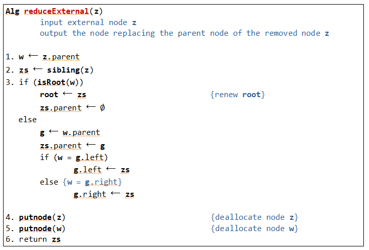

### 알고리즘 의사코드 짜보기

#### 제자리 선택,삽입 정렬

>```c
>Alg inPlaceSelectionSort(A)
>
>for pass<- 0 to n-2
>	minLoc<-pass
>	for j <- (pass+1) to n-1
>		if(A[j]<A[minLoc])
>			minLoc<-j
>	A[pass]<-A[minLoc]
>```
>
>```c
>Alg inPlaceInsertionSort(A)
>
>for pass <- 1 to n-1
>	save <-A[pass]
>	j <-pass-1
>	while(j>=0 & A[j]>save)
>		A[j+1]=A[j];
>		j<-j-1
>	A[j+1]<-save
>```
>
>오름차순 정렬

#### 힙과 힙정렬

>
>
>삽입노드를 찾기 위한 마지막 노드갱신
>
>```c
>Alg advanceLast(z)
>while(z->parent->right=z){
>	z<-z.parent	
>}
>while(z->parent->left=z){
>	z<-sibling(z)
>}
>while(z.left!=NULL & z.right!=NULL){
>	z<-z.left
>}
>
>
>```
>
>삭제노드를 찾기 위한 마지막 노드갱신
>
>```c
>Alg retreatLast(z)
>while(z.left!=NULL & z.right!=NULL){
>	z<-z.left
>}    
>while(z->parent->left=z){
>	z<-sibling(z)
>}
>while(z->parent->right=z){
>	z<-z.parent	
>}
>
>```
>
>
>
>

